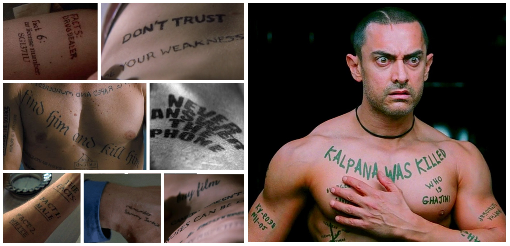

I am an engineer. I feel like I've been an engineer for as long as I can remember. It's been a foundational part of my identity since the very beginning.

I am also very forgetful. I've been forgetful for as long as I cannot remember, and when you combine these two things, you get a glimpse at an odd solutioning process that has been in trial for roughly twenty years.

Yeah, yeah, I know it should have ended up like this:

But I'm not quite ready to start working out regularly, so let me tell you about how my journey went instead.
