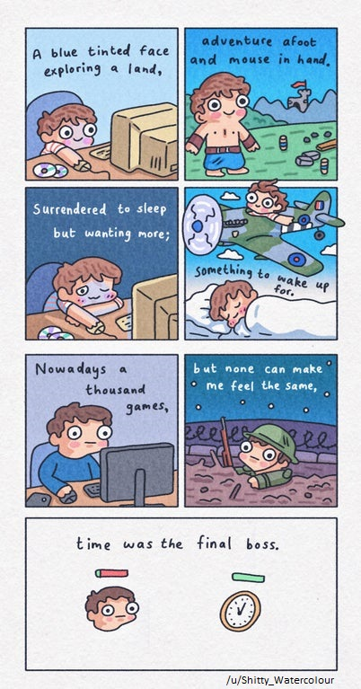

    
Index

    <ul>
        <li><a href="#so-much-grinding">All the unnecessary grinding</a></li>
        <li><a href="#squeezing-profits">Screwing over customers to squeeze profits</a></li>
        <li><a href="#sacrificing-gameplay">Sacrificing gameplay for long stories or impressive graphics</a></li>
        <li><a href="#spoilt-for-choice">We're spoilt for choice</a></li>
        <li><a href="#no-time">There's just not as much time to play anymore</a></li>
        <li><a href="#recommendations">Recommendations</a></li>
    </ul>

Childhood is quite a diverse thing. As a kid, we all had our unique 'go-to' for when we were bored. It could've been reading books, building a treasure map with your friend, playing with trading cards or watching your parents argue.

Mine was video games. A hobby I still carry with me today, but sadly things are not the same.

I grew up playing classics like [Road Rash](<https://en.wikipedia.org/wiki/Road_Rash_(video_game)>), [Wolfenstein 3D](https://en.wikipedia.org/wiki/Wolfenstein_3D) and [Captain Claw](<https://en.wikipedia.org/wiki/Claw_(video_game)>) among many, many more. I might have been only three years old, but if you've ever watched a kid have a go at technology, you'll know that's never a problem. Through muscle memory and repetition, I figured out the game objectives and gameplay mechanics, even though everything else went over my head.

The immersion of video games is incredibly potent for imbibing complex concepts and foreign culture,[^1][^2] and so those very cultural clues and references that escaped me would shape my reality through the years.

To give you some context, Wolfenstein taught me about Hitler almost a decade before I would even learn about the World Wars; and Road Rash made me listen to [Soundgarden](https://www.youtube.com/watch?v=_WPr7VhsFMU) roughly _two_ decades before I would use them as inspiration to make music in the same genre.

##### And no, video games didn't make me violent either. Bummer, right?

What I'm trying to say is that the video games I played growing up, make up a good part of who I am today. For the better, even.

In contrast however, I know that the video games I play now, will have little to no influence to my future self.

Why is that? Let's take a look.

<h2 id="so-much-grinding" class="internal-link">All the unnecessary grinding</h2>

It is quite sad how so many modern games have taken the concept of a reasonably paced, fun and linear character progression and turned it into an unrewarding, repetitive chore.

As a kid, if I was asked to do the exact same thing again and again to level up my character, with no change in gameplay or anything new to explore, I'd think the game was broken. I have to admit I've quit a sad amount of games in the middle because of this, such as [Destiny](<https://en.wikipedia.org/wiki/Destiny_(video_game)>) and [Final Fantasy XIV](<https://en.wikipedia.org/wiki/Final_Fantasy_XIV_(2010_video_game)>).

At least with a parody browser game like [Cookie Clicker](https://orteil.dashnet.org/cookieclicker/), you knew what you were getting into.

A few games do manage to make the process fun by making the grind short, following actual logical progression and involving stages of gameplay directly into the grind, making you forget that you're grinding altogether. Notable examples being [Minecraft](https://en.wikipedia.org/wiki/Minecraft), [Stardew Valley](https://en.wikipedia.org/wiki/Stardew_Valley), [A Dark Room](https://en.wikipedia.org/wiki/A_Dark_Room) or [any Grand Theft Auto game](https://en.wikipedia.org/wiki/Grand_Theft_Auto).

Even worse perhaps is that a lot of games deliberately introduce horrible grinds as a way to make you give up and pay to unlock whatever you were grinding for, which brings us to...

<h2 id="squeezing-profits" class="internal-link">Screwing over customers to squeeze profits</h2>

DLC? Microtransactions? If you tried to explain those things to me as a kid, I might have quit video games outright, and I find it really depressing that the kids of this generation have to deal with such terrible practices.

##### To be fair, I have no qualms when executed correctly and decently. Good examples include DLCs from The Witcher 3, or microtransactions that are purely cosmetic such as in CS:GO. However, many big AAA titles seem to reflect plain corporate greed, locking game items on day one of launch that can also be unlocked with in-game grinding. If their aim is to fleece money from ten year olds, they can surely afford to be a bit more subtle about it.

Perhaps this was inevitable once video games entered the mainstream and video game development became more accessible, allowing the video game industry to rise, and video game companies to turn into corporate machines with departments dedicated to maximizing revenue.

But in what world does it make sense to pay 80 USD (or more) for a game, only to find out that main characters or maps or parts of the main story remain locked, until you also pay for them in-game as DLCs or microtransactions?

The most downvoted reddit comment of all time (currently sitting at -668,000 downvotes) is by Electronic Arts who shamefully tried to defend why you had to go out of your way to unlock main characters even after you paid full price for the game.[^3] It even made its way into the Guinness World Record book for 2020.[^4]

Keep in mind that this is the same company that made Road Rash twenty eight years ago, a game that had no DLC or microtransactions when you bought the full game.

Another dirty strategy is when multiplayer games offer exclusive in-game items available for a price which gives your character extra powers or stronger weapons, so usually the winning player ends up being whoever paid the most.[^5]

A lot of big video game companies have lost the trust of their playerbase as a result of selling themselves out for profit without thinking about customer loyalty. Of course, this is just short-sightedness and it does hurt them in the long run as all the collective negative PR dents future investments.

##### Blizzard, Paradox, Bethesda are some companies among others that have recently been involved in scandals that pissed everyone off. Feel free to look these up in more detail.

<h2 id="sacrificing-gameplay" class="internal-link">Sacrificing gameplay for long stories or impressive graphics</h2>

When I was a teenager, if someone brought up a new video game release in conversation, the first thing you'd ask was how good were the graphics.

To us back then, that was the measure of how immersive a game was going to feel. The more realistic the graphics, the more fun the game would be, right?

Maybe things have since changed, or I've simply grown up, because I don't think that way anymore. Don't get me wrong, a good story or good graphics is still nice to have, but it's become apparent over time that there is no substitute for good and fun gameplay.

Video games can be a cool platform to explore storytelling and new rendering technology, but focussing on gameplay should always be the first priority.

A lot of games today are still stuck appealing to those teenagers of yore, trying too hard to emulate "theatrical" concepts, or deliver "cinematic" experiences. But video games are not movies, and nor are they supposed to be, and that's a big point that these developers seem to be missing.

Remember the [Assassin's Creed franchise](https://en.wikipedia.org/wiki/Assassin%27s_Creed)? The first few games were almost era defining. After its success, Ubisoft went on to create their own graphics engine for the series and they've been shoehorning long drawn out disconnected stories since. I tried to give some of their new games a shot, but imagine my surprise to discover a glitch infested mess instead :

The "impressive graphics engine" doesn't catch your attention anymore now, does it?

##### Maybe this is an unfair comparison: Assassin's Creed Unity did launch with a whole range of hilarious glitches that were not present in later games,[^6][^7] but I feel that it does reflect Ubisoft's enthusiasm to release sequel after sequel without caring about the player's experience.

Some people claim to have enjoyed the last few games, but I have to admit they felt more like soulless RPGs to me compared to the old Assassin's Creed that I knew and loved.

Today when a video game release focuses more on graphics, and touches very little on gameplay, I instinctively label that as a red flag.

Of course, there are a lot of games that manage to nail the balance. Later on in the post, I'll recommend some modern games that did not skimp out on good gameplay.

<h2 id="spoilt-for-choice" class="internal-link">We're spoilt for choice</h2>

Alright, this one isn't anyone's fault. It is simply the result of having limited time or money, whichever the case is, to spend on games as an adult.

I know I can't play every game that's ever going to release, and while that doesn't exactly make me very sad, what it does mean is that I get to be picky.

This means that out of all the millions of games[^8] that you can purchase and play, you get to prioritize those that have better reviews, have more playtime, are on sale, etc. As a result, even picking which game to play can take a considerable amount of time and effort. You can go for the hottest pick in your favorite genre, but then you're missing out on the lesser known hidden gems that often fly under the radar which would have been right up your alley :

These video games might look like jokes, but they've been received more favorably than a lot of AAA titles[^9][^10], and I can personally attest to how much fun they can be.

For this reason, when people say that "back in their days", video games had a lot more passion, I think that's just nostalgia speaking. If anything, the quality of video games has only gone up due to the competition and popularity of it. There are a lot of modern games that are exceptionally good, and many that I am actively looking forward to playing.

##### All these games mean that there is now extra pressure among game developers to stand out among the competition. In a free market, this often results in upcoming indie games turning out to be amazing works of art, but it also means that the remaining majority of games remain underwhelmingly poor in quality. This incentive to reward only the exceptionally good games often results in small developers not being able to compete with bigger studios that have more resources, which means that this also removes buying power available in the hands of the consumers to reward fresh content and break emerging monopolies from big video game companies.

However with so many good games coming out every year, and so many of them going on sale, my collection of unplayed games just keeps piling on and on, which brings us finally to :

<h2 id="no-time" class="internal-link">There's just not as much time to play anymore</h2>

The worst part about being an adult: No free time. Whether you're in college, or you have a job, most of your time is just.. gone.

Maybe now you have the money to buy all the games you wanted, but somehow playing them has been pushed to a luxury activity that you indulge only in the weekends. I bet you didn't see that coming as a kid.

I get it. That's how it's been for me. I've completely lost count of how many unplayed games are sitting in my Steam library right now.

Will I ever get around to playing them all? Most likely not. Even playing for more than a couple hours now feels like I'm being horribly unproductive.

Does that mean I'll stop buying games every sale though? Fuck no.

---

<h2 id="recommendations" class="internal-link">Recommendations</h2>

Alright, I think this post has had enough negativity. The way I enjoy video games today may not be the same when I was a kid, but if you were to look, you'd find the same amount of passion and life in the video game culture now, just as it was then.

Here's a short list in no particular order of video games I've played in recent years that I wholeheartedly recommend :

- [Outer Wilds](https://en.wikipedia.org/wiki/Outer_Wilds): Adventure, Puzzle, Space-flight.
- [The Witcher 3: Wild Hunt](https://en.wikipedia.org/wiki/The_Witcher_3:_Wild_Hunt): Action, Adventure, Role-playing.
- [Inside](<https://en.wikipedia.org/wiki/Inside_(video_game)>): Horror, Platformer, Puzzle.
- [LISA](https://en.wikipedia.org/wiki/Lisa:_The_Painful_RPG): Platformer, Post-apocalyptic, Role-playing.
- [Counter-Strike: Global Offensive](https://en.wikipedia.org/wiki/Counter-Strike:_Global_Offensive): Competitive, First-person Shooter, Multiplayer.
- [Hitman 2](<https://en.wikipedia.org/wiki/Hitman_2_(2018_video_game)>): Action, Episodic, Stealth.
- [Minecraft](https://en.wikipedia.org/wiki/Minecraft): Sandbox, Survival, Voxel.
- [Life is Strange](https://en.wikipedia.org/wiki/Life_Is_Strange): Adventure, Episodic, Young-adult.
- [Orwell](<https://en.wikipedia.org/wiki/Orwell_(video_game)>): Episodic, Simulation, Text-based.
- [The Elder Scrolls V: Skyrim](https://en.wikipedia.org/wiki/The_Elder_Scrolls_V:_Skyrim): Medieval, Open World, Role-playing.
- [Kerbal Space Program](https://en.wikipedia.org/wiki/Kerbal_Space_Program): Sandbox, Space-flight, Simulation.

As for video game companies, not all the big ones are horrible even if I do think most of them are.

[Valve](https://en.wikipedia.org/wiki/Valve_Corporation) has still kept my trust despite making CSGO free to play which made some of us very uncomfortable.[^11]

[CD Projekt Red](https://en.wikipedia.org/wiki/CD_Projekt) really left an impression with their Witcher series, and how well they catered to the playerbase. [Cyberpunk 2077](https://en.wikipedia.org/wiki/Cyberpunk_2077) is next on their list and I can't wait for it.

---

That about sums up my rant.

If you'd like to watch me play video games for a change, feel free to check out [my Twitch channel](https://www.twitch.tv/enkryptontwitch).

I'm also hosting a [small community Minecraft server](https://minecraft.arvind.io/), and anyone reading this is welcome to join.

And lastly, if you'd like to join me for a game, or see what games I've been playing, you can also [add me on Steam](https://steamcommunity.com/id/TheEnKrypt).

Thanks for reading, and happy gaming!

[^1]: [1. Video Games Can Help Us Un­der­stand His­tor­ical Change | University of Helsinki](https://www.helsinki.fi/en/news/language-culture/video-games-can-help-us-understand-historical-change)
[^2]: [2. What Video Games Can Teach Us | Science News for Students](https://www.sciencenewsforstudents.org/article/what-video-games-can-teach-us)
[^3]: [3. EACommunityTeam comments on 'Seriously? I paid 80\$ to have Vader locked?' | Reddit](https://www.reddit.com/r/StarWarsBattlefront/comments/7cff0b/seriously_i_paid_80_to_have_vader_locked/dppum98/)
[^4]: [4. EA Received A Guinness World Record For Most Downvoted Comment In Reddit History | Kotaku](https://kotaku.com/ea-received-a-guinness-world-record-for-most-downvoted-1837955807)
[^5]: [5. Free-to-play - Pay-to-win | Wikipedia](https://en.wikipedia.org/wiki/Free-to-play#Pay-to-win)
[^6]: [6. Assassin's Creed Unity Has The Best Glitches | Kotaku](https://kotaku.com/assassins-creed-unity-has-the-best-glitches-1657939797)
[^7]: [7. Ubisoft apologises for Assassin's Creed Unity bugs - BBC News](https://www.bbc.com/news/technology-30226586)
[^8]: [8. How Many Video Games Exist? | Playsive](https://playsive.com/how-many-video-games-exist/)
[^9]: [9. Goat Simulator Review - IGN](https://www.ign.com/articles/2014/04/01/goat-simulator-review)
[^10]: [10. Untitled Goose Game Review - IGN](https://www.ign.com/articles/2019/09/20/untitled-goose-game-review)
[^11]: [11. CS:GO receives 14,000 negative Steam reviews in a single day after going free to play](https://www.pcgamer.com/csgo-receives-14000-negative-steam-reviews-in-a-single-day-after-going-free-to-play/)
