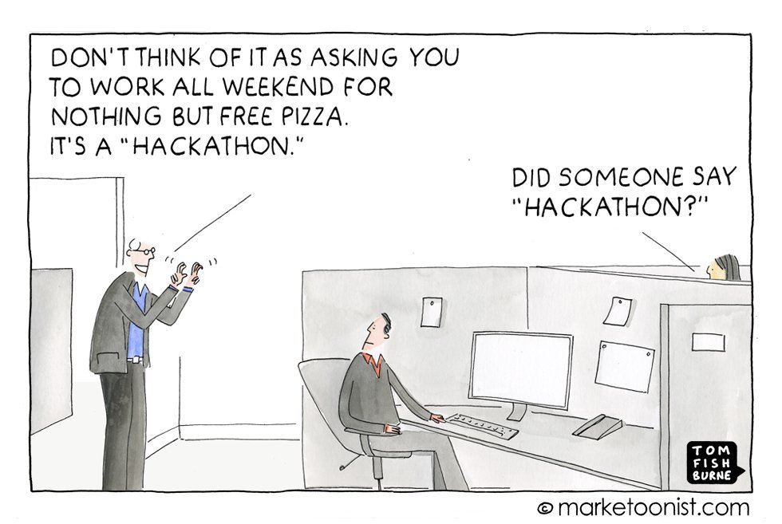
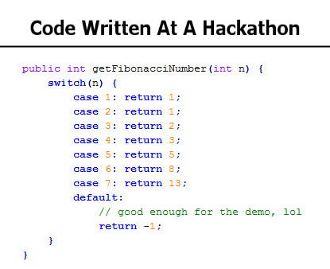
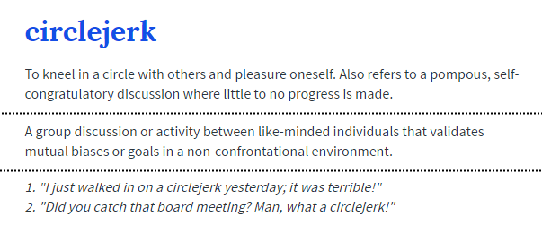

Just like any other competitive activity that exists for students, like sports, or Model UN, hackathons too have their own little culture going. I know this by [having attended plenty of these](https://docs.google.com/document/d/1xRVgPUirFY9QNeKzdPKfi6RQtCG7YmtUJ4oeDSJ1Ols/edit) to predict that in the next hackathon I go to, I'm almost sure I'll run into someone I've met at a hackathon before. \
However, I'm not convinced that's a good thing. For the sake of all students out there who still have the inspiration to get something meaningful done in their life, I sure as hell hope this doesn't become the next big trend among them unless the way hackathons work start to change, and I'm more than happy to explain why. Let this be a comprehensive guide to hackathons and what's currently wrong with them. \
(I hope to cover every vendetta, personal or in general, that I hold against hackathons, so bear with me if this article is a little long)

You could argue that working on your own cool little project for 24 hours among other creative people with free food and drinks sounds petty awesome. And honestly, that would be true if hackathons were fair and perfect. \
Unfortunately however, most of them are not; and all the people who frequent hackathons regularly know this as well.

That said though, some hackathons are not so terrible and are actually worth participating in. I'll start with the drawbacks of how hackathons work today, and move on to which ones you might consider going to.

## Oh, the horrors

---

A "hackathon" in today's terms is a horrible combination of:

a) organizers who want to make money, \
b) sponsors who want to shamelessly promote their brand which at times isn't even relevant to the event, \
c) judges who want to steal ideas that have merit for their own company from unsuspecting college students (I'm obviously exaggerating, but [it has happened before](https://www.reddit.com/r/Bitcoin/comments/3c6jw7/warning_hackathon_winning_blockchain_based_idea/)), and \
d) participants who want to bring their month or year old finished product and compete so they can get an easy win.

So why is the system this bad? This kind of characteristic "circlejerk\-esque" behavior is usually the result of an avalanche of moral decay caused by one bad persisting feature after another, such as :

-   **Restrictions on creativity :**

    -   Not a single hackathon that I've been to has encouraged the idea of simply hacking together a neat project. Kind of ruins the central philosophy behind a hackathon, doesn't it? The criteria for winning involves "what can sell" instead of "what is fun". I understand why this might be necessary but maybe the reason why hackathons have such a bad stigma is because they're so unnecessarily commercialized. This has been the biggest shock for me since my first hackathon and I'm still adjusting to it. To me, any good idea has merit regardless of whether or not it can make someone money. This can easily be solved by having an open mind while judging or having a more relatable panel of judges altogether. An example of a parody hackathon that was a great satire against this problem was [The Stupid Hackathon](http://www.stupidhackathon.com/).

    -   A lot of hackathons have a "theme" that your project is supposed to comply with. That's fine with me, but the shitshow starts to surface when you have to use a certain platform/technology/stack by mandate. These are usually not announced prior to the hackathon commencing and even if you don't **have** to use it, they provide you some incentive to, which still sways a lot of the participants out of greed to win. This usually happens by intervention of the sponsors and can be solved by keeping the event agnostic to the sponsoring agent.

-   **Unfair practices :**

    -   An overwhelming majority of hackathon winners are people who've begun well before the 24 hour time limit. A lot of people use hackathons as a break from their lives to come together and hack something new and innovative, and people like these who bring their already existing projects into the mix just ruin the spirit altogether. You can't confront them about it either as there are no specific rules in place about the shameless lengths you can go to for winning. Pre\-screening projects before submission might be a small fix, but there needs to be a proper solution to this before hackathons turn into a cheap platform to just shout out your startup ideas into an indifferent crowd.

-   **Bad commercialization :**

    -   You are judged by your presentation, not your project. As mentioned before, the judges are almost always swayed by profitable ideas instead of innovative solutions. This is because companies have stopped seeing hackathons as technical endeavors, so they send out people from marketing to judge. As a result, participants with strong presentations are seen as better candidates even if their technical stack aren't even in working condition. Sponsors need to start sending out actual developers and engineers who factor in things like code complexity and technical implementation in selecting the winners.

    -   Sponsors don't hesitate to shamelessly advertise themselves right in your face. Sure, I don't mind a brief intro and mentions about technologies I might actually use, but that rarely ever happens. The hackathon might have begun 12 hours ago, but there will still be a guy on stage talking about some weird product or API that has absolutely nothing to do with the hackathon or any of its themes. In retrospect, this is a bit sad to see because no one gives him/her any attention despite them having paid to be a sponsor for the event. Involving only strictly relevant sponsors doesn't sound like an impossible thing to do.

    -   Sucking up is more common than it should be. "Open hacks" aren't really open, all it means is "we'll **let** you code whatever you want, but we'll only favor those that are relevant to the sponsors". As ridiculous as it is for hackathons to expect you to "solve healthcare in 24 hours", it doesn't matter even if you manage to do so, because your neighboring team who wrote a bot with the sponsoring company's API is going to win. I get that there's always going to be some bias or the other from the judges, but maybe the sponsoring and judging entities should be kept isolated for this reason.

-   **Bad hygiene :**

    -   As an 18 year old, going a day or two without sleep might be alright occasionally, but that can soon take a toll on you. Unfortunately, most hackathons encourage you to stay up and push through (even if they don't actually say it), and then act surprised when everyone seems too tired to present their ideas the next morning, and those that do, deliver unenthusiastic and mediocre presentations. This can be solved by increasing the duration of the event, and just having all the participants leave at night, or just halting the event altogether at midnight by turning the lights off and insisting that everyone gets some sleep. Few hackathons have successfully done this before.

    -   Junk food is pretty much the go\-to solution for hackathons these days. Organizers have started to tie in with indoor caterers or simply bulk order from [freshmenu](https://freshmenu.com/) for example, but I'd really like to see this done throughout in other smaller hackathons too.

## But they're not all that bad

---

If you absolutely insist on attending a hackathon or have already been sucked too deep into the culture to quit, there are ways to find out the few that provide a decent experience.

First off, avoid hackathons at colleges or other institutions. They are a perfect example of every horror I've listed above. If you replace professional organizers with a student body, you can't really expect anything different. Do not waste time in one of these unless it's a hackathon happening in your own college, and you don't mind killing a night with your friends.
Second, look for "branded" hackathons with a good reputation through the years. My city doesn't have many of these, but I'm aware that some of the hackathons in the US (some even from institutions) can be a fun experience as they've dealt with and refined the same problems over years and have pretty much turned hackathons into art at this point.
If you can't find anything like that, look for hackathons with only one sponsor overall. You can always tell these apart by the name of the event. You don't need to be a genius to know that the InMobi Hack Day is sponsored primarily just by InMobi. You still might have to deal with biased judges in this instance, but there at least won't be a conflict in themes and commercial interests. You can rest assured that they can afford to have more professional organizers who will help you out better when the need comes.
Lastly, if you do settle on a hackathon, call them up and inquire about the themes, the meals and the winning prizes. If they can't answer any of those questions or tell you that they will be answered at the event, you should consider calling it quits as any reason for doing so is almost always a bad one. This also helps to get a measure of how good or bad the organizers are going to be in general.

If you've finally settled for a hackathon that you're going to attend, whether a good or a bad one, here's a few a good things you can expect along the way :

-   **Learning :** No matter how simple your idea is, you're going to be surprised how awfully difficult it can be to set things up when you're coding live. You're going to run into bugs you didn't even know could exist, and when it's not a bug, it will be a logical flaw in your planning itself. Dealing with these things under pressure is really an experience and will make you a better developer by the end of it all.

-   **Networking :** Probably the biggest resource in a hackathon are the people around you. Go ahead and talk to the people and find out what they're hacking. You never know who among them could end up being a future teammate or help you get an internship.
-   **Actually build something :** You and your friends will come up with a lot of crazy ideas over time and in your leisure, but how many of them are actually worked upon and completed? A hackathon is a really nice way to actually get people together and work on an idea that you've always had. It serves as a social event, and at the same time isn't quite, so you can use it as a convenient excuse to take a small break form your other commitments and responsibilities momentarily.
-   **Bragging rights :** Of course, winning a hackathon is always such a sweet feeling. Depending on how popular the hackathon in question is, it could also serve as a neat little badge on your resume. If the winning prize turns out to be decent too, that would be the icing on the cake.

I'm not playing Devil's advocate here though. My overall opinion was and still is, that hackathons suck.
If you've never been to a hackathon, or even fully understand what a hackathon is, that's good because you can't miss something you've never had. Next time someone invites you out for a random hackathon that doesn't match the above criteria, you can take the opportunity to laugh and promptly walk away. You're not missing out on much, I promise. Even if you have this insane idea for an app or website that will floor any competition, the experience of a hackathon is hardly worth the measly prize at the end of it. I'd advise you to just gather a bunch of enthusiastic people and try your luck as a startup instead. Even if it doesn't take off, your productivity and experience with reality along the journey will thank you.

