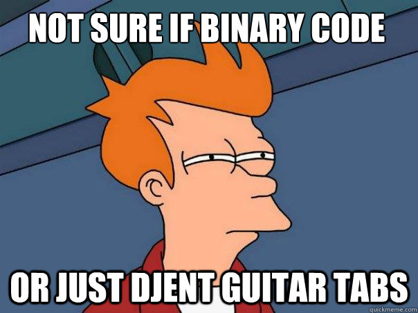

On September 1996, progressive rock band Tool released a track as part of their album called [Ænima](https://en.wikipedia.org/wiki/%C3%86nima), which would go on to debut at No. 2 on the Billboard 200 chart upon its initial release.[^1]

The track in question is called 'Forty Six & 2'

<iframe class="embed" src="https://www.youtube.com/embed/GIuZUCpm9hc"></iframe>

Why the '& 2'? Why is it part of the track's name and what does it mean?

The band has routinely refused insight on any of their music. Their idea is to let the listener's interpretation run free, and not be clouded by the artist's intentions or biases. There are even no official lyrics for any of their songs. However within the community, there is some consensus on the meaning of the song's title. I'll let you look it up.

But this is just a song, and songs are meant to be abstract. Let's look at a different, more concrete example :

Here GrandMaster Ben Finegold analyzes a chess match (Nakamura vs Shabalov in 2005 Foxwoods Open) in a Middlegame tactics class. Watch from 12:43 to 14:10.

<iframe class="embed" src="https://www.youtube.com/embed/_ijunCGyTmI?start=763&end=850"></iframe>

The concept of "two" seems to have powerful meaning and applications even in chess: a strategy game almost as old as history.

So what's the point? What am I getting at? Let's analyze further.

The concept of the number '2' can be used abstractly to represent many ideas: **binary**, **duality**, **dichotomy**, **coupling**, and well.. a lot more.

Moreover, almost any field of study or expertise makes use of powers of two in some implementation of its theory.

-   Let's take computers:

    According to IEC, one kilobyte represents 1000 bytes.[^2] Yet, convention (and convenience) has made this standard very unused. Even today we use the older measure in casual conversation, which is that one kilobyte represents **1024** bytes, one megabyte represents **1024** kilobytes and so on. Powers of two.

    There is an official term by IEC for 1024 bytes. It's called a kibibyte. But when was the last time you heard someone use that term out loud? Computer memory began as groups of two states, and then we continued to group in twos for convenience, and that led to our current tendency to talk about digital memory as powers of two.

-   Let's take music theory:

    Do you know what a **demisemihemidemisemiquaver** is?

    It's an actual term in music theory. It represents the two hundred fifty-sixth note.[^3]

    Why does this exist? The time interval within a bar or a measure gets divided by 2 every time we want to add a note between two already existing contiguous notes. As you keep dividing, we eventually get 128th notes, 256th notes, 512th notes, and so on in powers of two.

    I normally use this concept to illustrate that knowing music theory is a means to an end, and understanding the idea behind a 256th note is enough and you don't need to learn the demifuckinghemisemi whatever formal term exists for it. However, once again we see that the power of two remains ever present in a field that has nothing to do with math.

The fact that we chose the decimal system is actually completely arbitrary.

In fact, many civilizations throughout time _did not_ do so, and independently made use of some other base.

For example, the Babylonians used base 60, the Mayans used base 20, and so on.[^4]

All that said, now the important point that this has led up to so far is this :

**The use of binary system however is NOT arbitrary.**

Base 2 or binary is the simplest system to encode and communicate any kind of information. All you need is two states which can be anything (on or off, black or white, 0 or 1), and a sequence representing a manifestation of these states.

That is why the binary system was used and is still used in all digital formats and in all computers.[^5]

What I'm trying to get at is that the concept of two, is more than just a simple number. \
It's more than a decider of what is even. \
It's more than the ... number of biological parents everyone has.

##### And it's also more than the number of genders that exist.

It's an idea. Something you can apply to all kinds of unexpected areas in life.

You can use it to understand music, or you can use it to get better at chess. You can even use it to build a fucking computer just for bragging rights.

Food for thought.

---

Thanks for sticking through my ramblings. These kind of abstract posts are not for everyone, and while they used to be a part of my writing style long ago, I've since lost the habit.

Older versions of my blog had a lot of abstract posts like this, and a lot of my readers seemed to enjoy them. It'd be quite a loss if this one had none, hence my impulse to write this post. I will not publish this, or post it on the internet to be discovered, and chances are that I will not write anything abstract again for quite a while.

On another note, is anyone else excited and can't wait till August 30th when Tool's new album drops? I sure as fuck am.

[^1]: [1. Tool's 'Lateralus' Leads Five Top-10 Debuts](https://www.billboard.com/articles/news/79641/tools-lateralus-leads-five-top-10-debuts)
[^2]: [2. Kilobyte - Wikipedia](https://en.wikipedia.org/wiki/Kilobyte)
[^3]: [3. Two hundred fifty-sixth note - Wikipedia](https://en.wikipedia.org/wiki/Two_hundred_fifty-sixth_note)
[^4]: [4. Why have we chosen our number system to be decimal (base 10)? - Mathematics Stack Exchange](https://math.stackexchange.com/a/8748)
[^5]: [5. Binary code - Wikipedia](https://en.wikipedia.org/wiki/Binary_code#History_of_binary_code)
