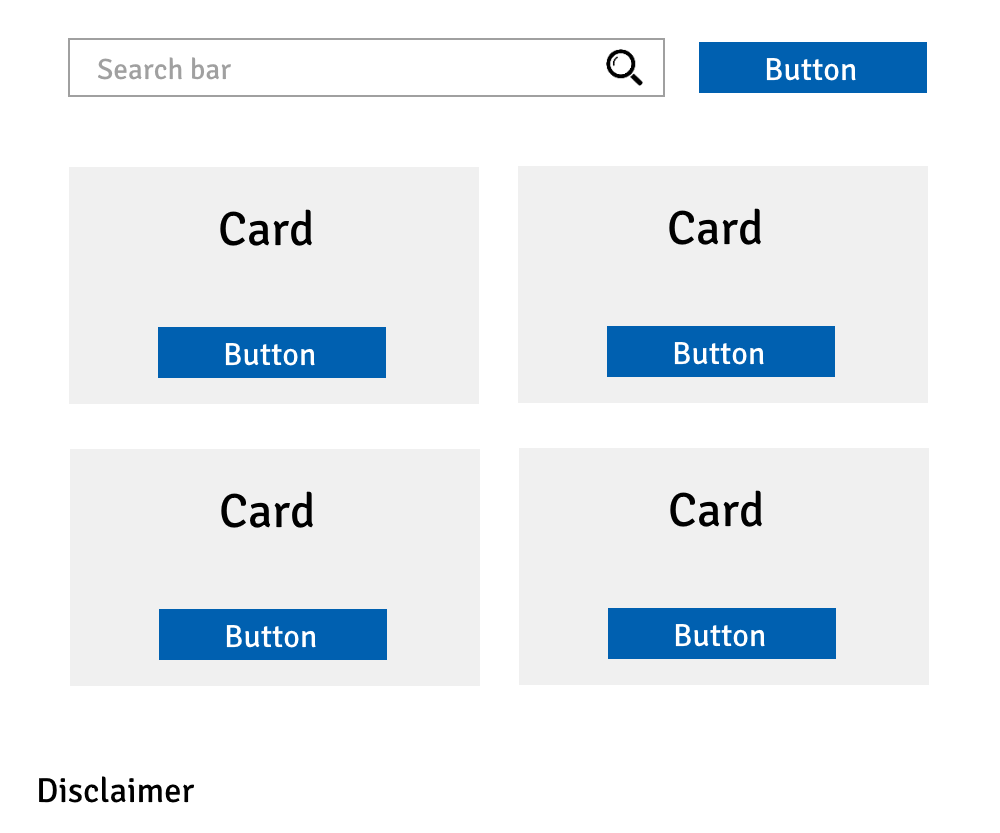

<div class="index">
    <div class="index-title">Index</div>
    <ul>
        <li><a href="#components">Understand when to break down components</a></li>
        <li><a href="#state">Identify your state and when it needs management</a>
        <li><a href="#hoc">Don't get tripped up by HOCs</a></li>
        <li><a href="#inline">Embrace inline JSX-fu</a></li>
        <li><a href="#tests">Write tests for your frontend</a></li>
    </ul>
</div>

React as of 2019 is the most popular library for the web.[^1][^2]

One of its major selling points is that it integrates quite seamlessly with good old Javascript, giving you a lot more freedom to write your code however you want. However this freedom also makes it very easy to write bad or messy code.

What counts as good code and what counts as bad code is perhaps the subject of a future blog post, but for now I want to list down a few helpful ideas that were not obvious to me when I first started writing in React four years ago.

##### The following is not meant to be an exhaustive set of ways to go about writing React. There are exceptions to every rule of course.

<h2 id="components" class="internal-link">Understand when to break down components</h2>

Aggressively separating everything into a component can be just as bad as being too conservative and cramming everything in just one or two components.

The trick is to find the balance in between the two extremes, where components that matter can just be used as plug and play, but at the same time you're not stuck with a thousand component jigsaw puzzle.

When deciding if something should be split into its own component, ask yourself this :

- Is it likely to be re-used?
- Does it clearly help reduce the complexity of the parent component?

If the answer to either is yes, then it absolutely should be its own component.

If it's not however, here comes your opportunity to make a judgement call. \
Breaking a component down because you don't want to deal with a 300 line component behemoth is fair in my opinion; but on the flip-side, if you find yourself willing to deal with a reasonably small and simple component and treat it as a single entity without breaking it down further, I think that's fair too.

Let's take a look at an example. I apologize in advance for the poor illustration.



Some components are easily identifiable.

`Button` should be a component, and so should `Card` since we're seeing them being clearly re-used.

`SearchBar` and `Disclaimer` however lie in a sort of grey area.

I would say that `SearchBar`, even though it's not re-used here, might have some latent potential to be repurposed. It also helps reduce the complexity of its parent to a certain extent, so I might make a component for it.

`Disclaimer` however, is much more ambiguous. Assuming that the disclaimer is specific to this screen, we're not going to need it anywhere else, and I also don't have any problem picturing it as part of the parent as a single entity. In this scenario, I might just leave it inside the parent, but along with increase in scale and complexity, this may prove subjective.

There are also components here that you should **not** make.

Components like `ButtonText` or `CardText` (for our simple non-dynamic card) would not be useful, and only add to the overall complexity of the code.

Take rendering the text inside `Button` for example. Ideally, you would want to pass the text as children (not as a prop) to the `Button` component from the parent directly, as such :

```jsx
<Button>Card text goes here</Button>
```

and then within the component's `render()` method, display the children :

```jsx
class Button extends React.Component {
  render() {
    return <div>{this.props.children}</div>;
  }
}
```

Hence making a `ButtonText` component would be a bad idea as it takes away this flexibility and introduces an avoidable layer of complexity. `CardText` or `CardContent` in our case would be just as bad, but if your `Card`'s structure is not fixed and might contain dynamic content, then an argument could be made.

<h2 id="state" class="internal-link">Identify your state and when it needs management</h2>

A common mistake I've seen repeated often is to just dump all component attributes into state.

Only those properties which should trigger a re-render on being changed via `setState()`, should be put into state.

Any other attribute that doesn't need to re-render or change something on the UI, does not belong in state. Consider declaring it as a simple class property instead.

```jsx
class Card extends React.Component {
  state = {
    visible: true // Should trigger a re-render on being changed
  };
  wasHiddenBefore = false; // Not UI related, so it doesn't belong in state
}
```

With that out of the way, we should talk about the elephant in the room.


Oh God no, not you. Jesus Christ, talk about having traumatizing flashbacks.

I'm talking about **State Management**.

[Redux](https://github.com/reduxjs/redux), for example is a very popular library for state management.

However, Dan Abramov, the creator of Redux himself, often writes about how most people probably don't even need it.[^3]

This is one of those instances where knowing a convention is not enough. You should also know _when_ to use it lest you fall into problems created by reckless over-engineering.

Just like knowing when to separate components, when to use state management also has a similar answer: **When it gets too complex without**.

For most small websites, including this blog, local state is good enough.

When the hassle of passing props around becomes too complex, like say you find yourself passing the same props down to so many components consecutively that simply imagining the flow takes significant effort, it might be time for state management.

Introducing state management before that point only _adds_ to the complexity instead of removing it.

##### That said, I have to confess that I have never been a fan of Redux, even when the case for state management was sufficiently made. I could never stand the boilerplate of adding separate reducers, actions, selectors, effects/thunks every time I wanted to add a single variable to the store. If you're not too anal about trying out new things, give [mobx-state-tree](https://github.com/mobxjs/mobx-state-tree) a shot.

<h2 id="hoc" class="internal-link">Don't get tripped up by HOCs</h2>

The term 'Higher Order Component' can be a bit misleading if you're not familiar with the etymology, because Higher Order Components are not components at all.


Technically, they're _functions_ that take in a component, and return a new component.

Once you understand that, HOCs should become easier to work around. Use them as a level of abstraction over components. Think 'class factory' except without the nightmares.

With that in mind, do not call a HOC within a component's `render()` method. \
The reason why this is bad is because a new component will be mounted every time the parent component is re-rendered, meaning you lose the state of the generated component and all its children.

<h2 id="inline" class="internal-link">Embrace inline JSX-fu</h2>

There's a thin line between code being readable, and too verbose.

You might think that conditional renders are best handled outside JSX for the sake of readability like so :

```jsx
render() {
    let extra;
    if (this.props.newUser) {
        extra = <PromotionalOffers />
    }
    return (
        <>
            <Content />
            {extra}
        </>
    );
}
```

But I'd argue that the following code is just as readable if not more, and definitely tidier.

```jsx
render() {
    return (
        <>
            <Content />
            { this.props.newUser && <PromotionalOffers /> }
        </>
    )
}
```

[React Fragments](https://reactjs.org/docs/fragments.html#short-syntax) as seen in both code snippets above can help you neatly structure your JSX further.

Again, the key here is moderation. If you take inline code patterns and turn it up to spaghetti levels of horror, you only have yourself to blame.

<h2 id="tests" class="internal-link">Write tests for your frontend</h2>


It seems that in the dark and fearful world of frontend development, there isn't quite a consensus on what the absolute right way to do frontend testing is, but that doesn't mean it can't be done or that it shouldn't be done.

If all the CI pipeline on your production application does, is run a linting check, then that's a big oof.

##### No, `PropTypes` in your code don't count either.

Similar to how Test Driven Development has obvious advantages in backend development, it can stop you from creatively shooting yourself in the foot when applied to frontend as well.

Testing libraries such as [Jest](https://github.com/facebook/jest), [react-testing-library](https://github.com/testing-library/react-testing-library) and [Enzyme](https://github.com/airbnb/enzyme) will help you get there.

[Snapshot testing](https://jestjs.io/docs/en/snapshot-testing) is useful for writing unit tests for stable components that are not likely to keep changing.

On the other hand, you have functional tests or end to end tests which you should write to test aspects of the UI flow from the user's perspective.

Writing tests is like having documentation. When it's good, it's really good; and when it's bad, it's better than nothing.

[^1]: [1. NPM Usage Statistics](https://npm-stat.com/charts.html?package=react&package=vue&package=%40angular%2Fcore&from=2014-12-12&to=2018-12-12)
[^2]: [2. StackOverflow Developer Survey 2019](https://insights.stackoverflow.com/survey/2019#technology-_-web-frameworks)
[^3]: [3. You Might Not Need Redux](https://medium.com/@dan_abramov/you-might-not-need-redux-be46360cf367)
