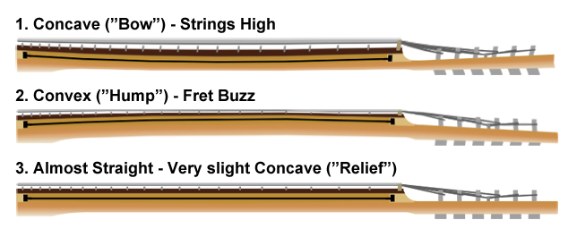
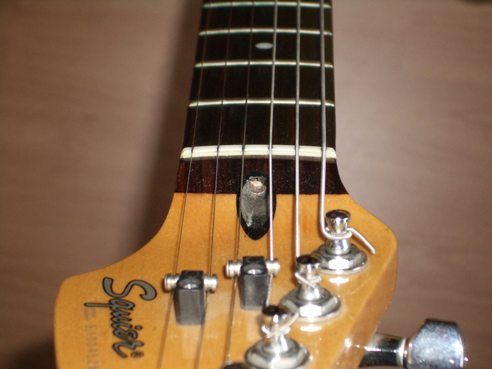
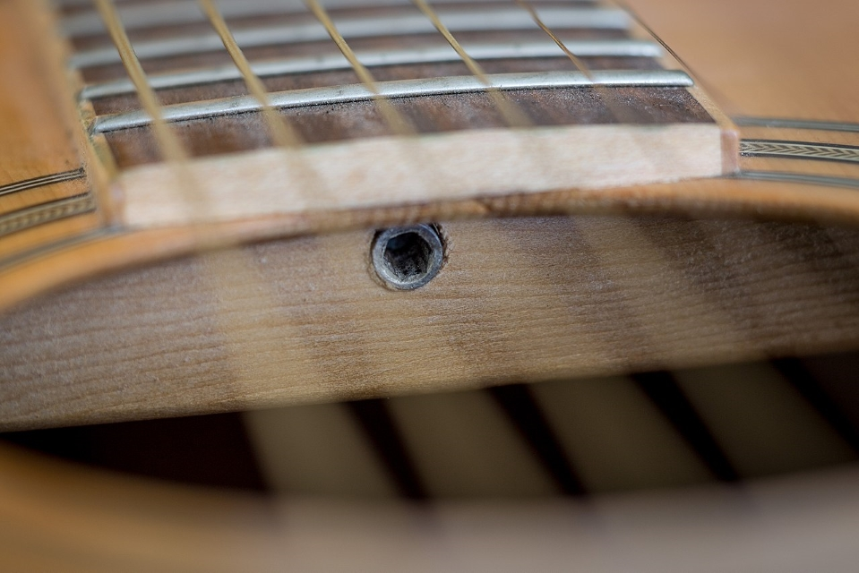
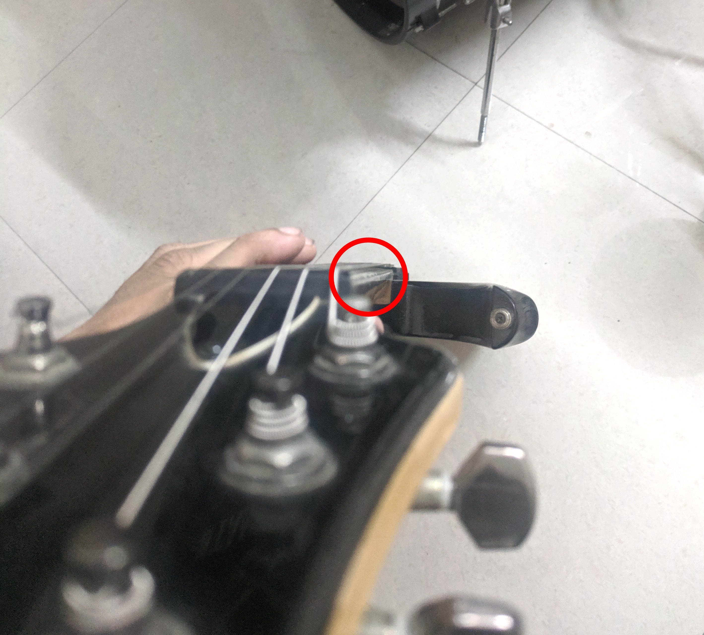
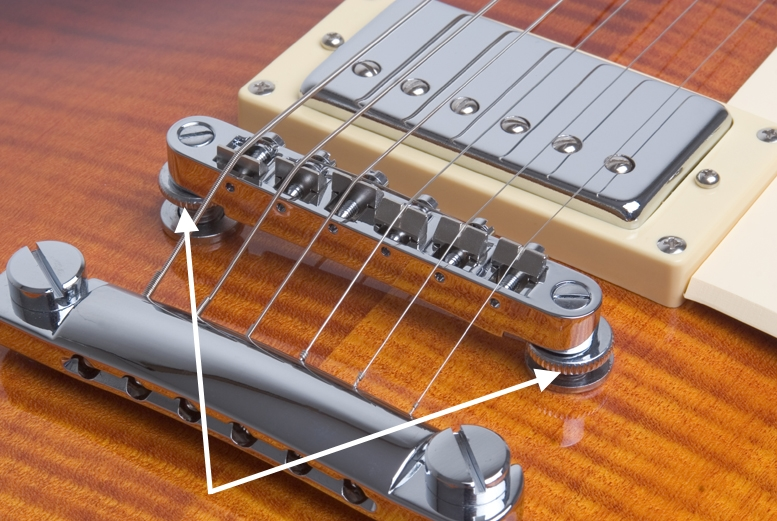
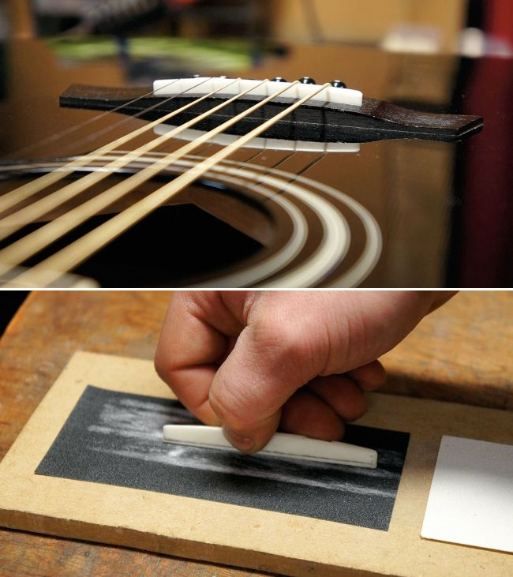
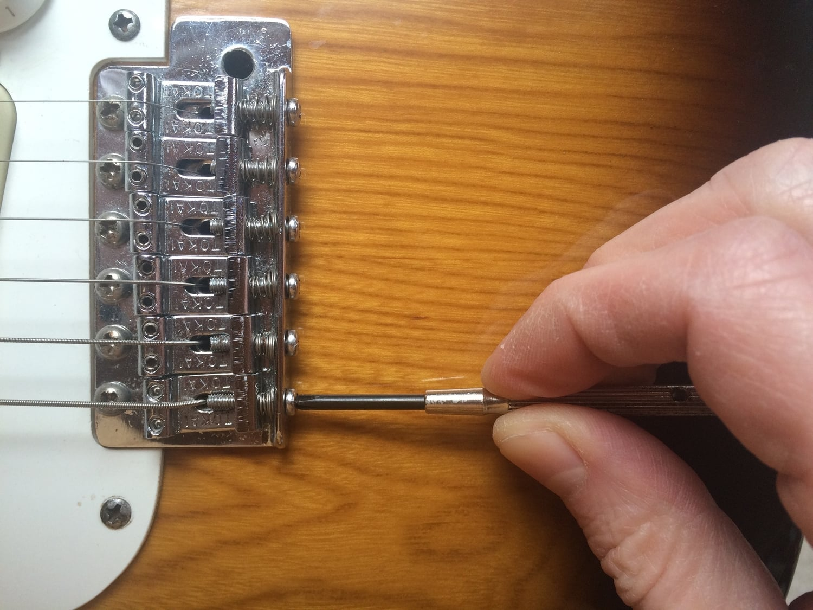
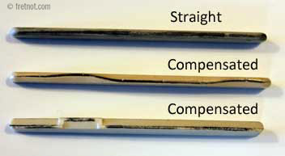

    
Index

    <ul>
        <li><a href="#intro">Why should you?</a></li>
        <li><a href="#action">Setting the Action</a>
            <ul>
                <li><a href="#truss-rod">Adjusting the truss rod</a></li>
                <li><a href="#saddle">Adjusting the saddle</a></li>
            </ul>
        </li>
        <li><a href="#intonation">Setting the intonation</a></li>
        <li><a href="#outro">What’s next?</a></li>
    </ul>

<h2 id="intro" class="internal-link">Why should you?</h2>

I wish someone taught me how to do this right when I first started playing guitar.

Setting the action and intonation on your guitar is incredibly important. If you're a guitar owner, knowing how to maintain your guitar is invaluably useful.

Since you're here, there's a good chance you already know why you need to make these adjustments, but here's a small summary anyway :

-   Setting the action will :
    -   Make your playing much more comfortable
    -   Possibly eliminate fret buzz
-   Setting the intonation will :
    -   Make your guitar sound in tune as you play on higher frets

These adjustments should be made immediately after buying a new guitar. If for some reason you haven't, or like me you just didn't know about it until much later, feel free to do it now as you're reading this post. This is something that can be done on every kind of guitar including bass guitars and acoustic guitars, so you really have no excuse.

##### On acoustic guitars, there is no adjustment mechanism built to the guitar for some steps. While you can still make the adjustments, they will likely be non-reversible, so keep that in mind.

#### There are _two_ ways to set the action, and _one_ way to set the intonation.

You should be able to follow along regardless of whether you have a floating bridge, or even a bass guitar.

<h2 id="action" class="internal-link">Setting the Action</h2>

**Action** refers to the distance between the strings of your guitar and the frets. Also known simply as string height.

##### No, I don't want to listen to your shitty joke about how much action you got last night

Lowering the action of the guitar makes playing on it much easier and comfortable, but if you lower it too much, it can introduce fret buzz as you play.

The trick is to find the sweet spot by lowering it just enough that you find peak comfort while playing, but at the same time there is negligible fret buzz for your playing style.

There are two things you can do to help with this :

<h3 id="truss-rod" class="internal-link">Adjusting the truss rod</h3>

There is a rod that runs along the neck of your guitar which can bend slightly over time due to string tension and the effect of changing climate on wood, causing your guitar neck to curve.

I personally prefer the neck to be completely flat under playing conditions, but some prefer it with very slight concave bowing.

To adjust the truss rod, you will need a screwdriver, and an allen key.

##### A 5mm allen key is what I use for all my guitars, but the size really depends on the make of your guitar and what standards are used in your region. You may not even need an allen key if the mechanism calls for a female socket wrench, or a Phillips head.

On most guitars, you can access the adjustment point on the headstock of the guitar. You may need to take off the cover with a screwdriver.

On some acoustic guitars, you can access the adjustment point through the sound hole.

Make sure the strings are not in the way. You can detune the strings and push the middle strings off to the side.

Insert the allen key and rotate in the direction you want to adjust.

Rotate clockwise if you want to fix a concave bend. This will tighten the truss rod and give you lower action.

Rotate counter-clockwise if you want to fix a convex bend. This will loosen the truss rod and give you higher action.

Always rotate by small amounts (30 to 45 degrees at most) and wait for a minute or two while the wood adjusts.

Hold the guitar such that the frets are perpendicular to your eyes and observe the line the fretboard makes.

If the line is not exactly straight and flat, continue making adjustments until it is.

##### While the above method is generally good enough for an approximation, the ideal way to check for relief is to to hold down a string on the first fret and the fret where the neck joins the body (around the 17th fret on a regular strat), and then checking the clearance between the string and the frets in the middle (around the 8th or 9th fret region).

<h3 id="saddle" class="internal-link">Adjusting the saddle</h3>

This is the other way to adjust the action and it mostly affects the action along the higher frets of your guitar.

You can find the saddle as part of the bridge.

Some guitars have a fixed saddle. You can adjust the collective saddle height with the two rotating screws on each side of the bridge.

Other guitars have separate saddles for each string, in which case you can adjust the saddle height and thus the action for each string individually.

Either use a tiny allen key for the slots on top, or remove each saddle and adjust the screws on the bottom by hand.

Make sure you adjust both screws on each saddle by the same amount to keep it level.

These steps should apply to any kind of electric guitar, including bass guitars and floyd rose guitars.

On acoustic guitars (unless your guitar comes with an adjustable bridge), you will have to manually remove the saddle, and sand it off to the height you want.

This concludes setting the action on your guitar. With this, your playing should become much more comfortable. If you still notice fret buzz while playing at this point, you may have to raise your action by a small amount.

<h2 id="intonation" class="internal-link">Setting the intonation</h2>

**Intonation** is what I like to call: the instrument's essence of being in-tune.

A well maintained guitar has correct intonation, i.e. if the guitar is tuned perfectly, it continues to sound in tune as you play on higher frets on all strings.

##### If you're new to music theory, don't get confused between temperament and intonation. Intonation is the process by which a temperament is achieved.[^1] Most correctly intonated guitars are not in equal temperament.

If your guitar has never seen that kind of proper maintenance, or you've changed to a different string gauge since, it needs to be intonated right. Let's get to it. We'll need a screwdriver and a guitar tuner.

First, make sure your guitar is perfectly tuned. You can pick whatever tuning you want, it doesn't matter.

Next, pick a string and play the open note and check the tuning (it should be perfectly in tune), and then immediately follow it by playing the 12th fret on the same string and compare the difference on the tuner.

It should be the same note, one octave higher. If the 12th fret note is also perfectly in tune, move on to the next string.

If it is not however, we need to adjust the bridge saddle for that string.

But before that, you may want to detune that string a bit. As we adjust the intonation, the string tension is going to drastically vary, and if our strings are tightly wound in standard tuning for example, a further drastic increase in tension could be very bad.

To adjust the bridge saddle, use the screwdriver to turn the adjustment screw behind the saddle for that string.

If the fretted note is sharp, we need to move the saddle back (away from the neck).

If the fretted note is flat, we need to move the saddle front (towards the neck).

Turn the screw by a small amount, tune the string perfectly in open configuration again, and once more check the 12th fret note.

Keep making these adjustments until the 12th fret note is also perfectly in tune, and then repeat the process on all the other strings.

The process is the same for floyd rose or floating bridge guitars as well, if you follow these steps in the correct order.

On acoustic guitars, the process is unfortunately trickier. Your bridge likely will not have a mechanism to shift the saddle front and back like in electric guitars.

As a result, you will need a compensated saddle or a compensated nut. You can either sand your existing saddle, or purchase one that's already compensated.

With that, your guitar should be intonated correctly. Playing on it should sound much better and you should be able to tell the difference immediately if it was poorly intonated before.

A very simple way to verify the intonation, is to play a 12th fret natural harmonic. The location on the string where the harmonic is the loudest should co-incide exactly with the metal of the 12th fret.

<h2 id="outro" class="internal-link">What's next?</h2>

Now that your guitar's action and intonation are all set up properly, what can you do next to put your guitar in better shape?

Well first of all, as eager as you are, your guitar needs _regular_ maintenance. You will probably have to adjust the action and intonation again relatively soon.

Your truss rod needs to be re-adjusted every 6 months or so. You need to adjust the intonation if you change to strings of a different gauge. If you have a floating bridge guitar, you'll need to adjust the action via the saddle height for different string gauges and different tunings.

##### Yeah, this is why I'm not fond of floating bridges.

But sure, with that out of the way, there's a lot of other things you can go about adjusting or experimenting with, to fine tune what you can get out of your guitar.

For example, you can adjust the pickup height, which affects the tone. You can change the pickups outright to something better. You can also experiment with different string gauges (thickness), etc.

---

_What's that? You want to actually spend time playing and practicing to get better instead of just fiddling around with your guitar?_

Atrocious. How are you going to justify expensive and unnecessary upgrades to your instruments with that kind of attitude?

[^1]: [What is the difference between temperament and intonation? - Music: Practice & Theory Stack Exchange](https://music.stackexchange.com/questions/34427/what-is-the-difference-between-temperament-and-intonation)
