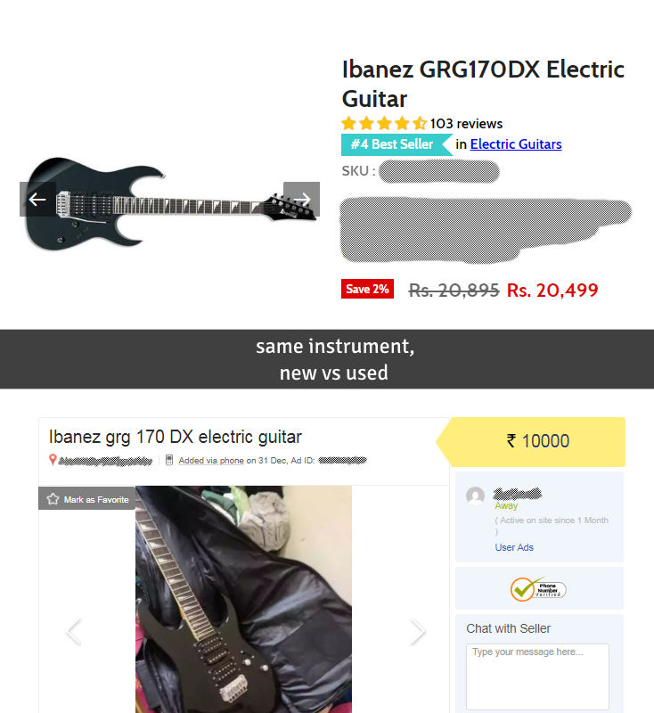
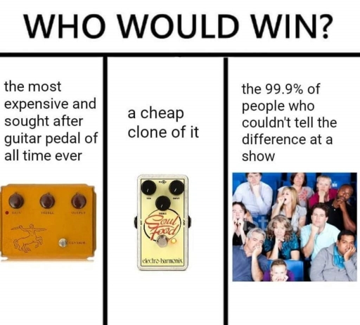
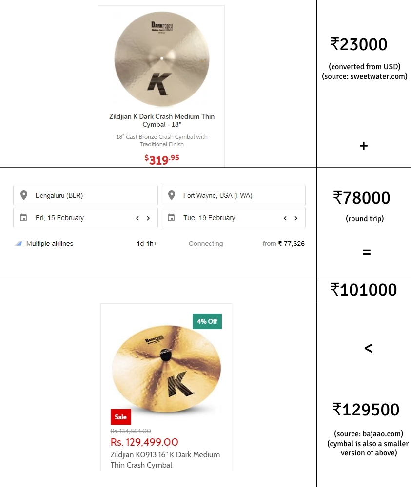
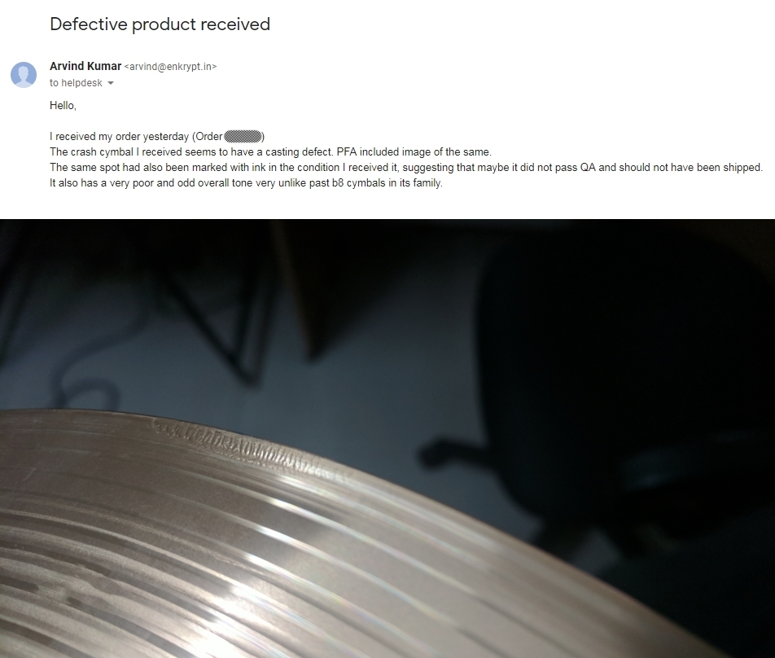

    
Index

    <ul>
        <li><a href="#intro">A Little Backstory</a></li>
        <li><a href="#general-rules">General Buying Rules</a>
            <ul>
                <li><a href="#rules-guitar">Guitar</a></li>
                <li><a href="#rules-drums">Drums</a></li>
            </ul>
        </li>
        <li><a href="#outlet-reviews">Outlet Reviews</a>
            <ul>
                <li><a href="#outlet-websites">Websites</a></li>
                <li><a href="#outlet-stores">Physical Stores</a></li>
            </ul>
        </li>
        <li><a href="#outro">In Closing</a></li>
    </ul>

<h2 id="intro" class="internal-link">A Little Backstory</h2>

Being a musician in this country can sometimes feel like being a vegetarian in a steak house.

Anyone who's ever tried, knows that you'll find it extremely hard to procure quality instruments and equipment without breaking the bank or getting ripped off.

##### If you don't care much about why that is the case, you may skip this section and go straight to [General Buying Rules](#general-rules).

Growing up, it was emphasized to me that choosing music as a career meant that I was discarding away academic opportunities that were handed to me, and even if I made that choice, anything outside the Indian classical genre was a form of degeneracy.

Sadly this sentiment exists throughout the country in some measure and as a result genres like rock or metal become a niche. Although new generations have done really well to change that, the number of people who listen to this genre isn't the statistic we want to measure; it's the number of people in this country who are _making_ music in this genre, which is a small fraction of the former.

The demand isn't high enough, so the supply isn't high enough, and the simple fact that you chose a drum kit over a [tabla](https://en.wikipedia.org/wiki/Tabla), or a piano over a [harmonium](https://en.wikipedia.org/wiki/Pump_organ#Harmoniums) is reason enough for any middle-aged store seller to overcharge you. Combine the fact that most reputable brands are not Indian, and now you have to deal with ridiculous import tax to top it off.

The deeper you dive into your hobby and the more specific your requirements get, the bigger the hole you will end up burning in your wallet. Unfortunately that's true for music here as well, except the niche is already dug deep for you. As a result no matter what, you will have to pay some premium, or exercise unreasonable patience if you don't want to rely on hard luck; but there are some general rules that will go a long way in trying to get a fair price, and depending on the instrument, things may get easier or harder.

<h2 id="general-rules" class="internal-link">General Buying Rules</h2>

-   Buying second hand is almost always the way to go

    

    This is a valuable life skill in general. Buying used will give you really good deals. Learn to negotiate well and test what you're buying thoroughly before making your purchase. \
    Personally I've found [OLX](https://www.olx.in/musical-instruments/) to be a good source for listings. Many instruments I play today are because of some really good deals I've found there. \
    Posting on sites like reddit or facebook may also get you somewhere. I've found that my city has a very active facebook group for buying and exchanging instruments and equipment, but your mileage may vary. \
    The second hand market in India for music isn't as fast moving however, so depending on how specific and rare the thing you're looking for is, you may have to wait weeks or months till you find a good deal.

-   If you can't wait for good second hand deals, going to a store and buying is better than buying online

    Instruments will sound very different when you hear them being played on a Youtube video vs in your room. Buying from a store lets you hear what it sounds like in person before buying, which you cannot do online. \
    Most stores also do price matching, i.e if you can show them a reputable online marketplace selling the same item for a lower price, they will drop their price down to match it.

-   Do your research and watch out for the cheap 'entry level' stuff that you know is low quality

    The prices might be very tempting, but playing on bad instruments will tend to demotivate you or limit you from advancing further, which means you will either waste your time and money, or end up spending more anyway if and when you have to upgrade. \
    If your justification is that you just want a trial or you're on a super low budget, either borrow from a friend, or sign up for classes and use what's available in the institute. Those are both better options.

<h3 id="rules-guitar" class="internal-link">Guitars</h3>

All things considered, buying any kind of guitar is relatively easy compared to other instruments. The reasoning behind it is also simple if you followed my opening paragraphs: there's a lot of people who play it. \
If you throw a brick outside, chances are it will hit a random guitar player. If you find that this person knows only how to play Wonderwall, please do us all a favor and throw that brick at him again.

Even so, although buying the actual guitar will probably not pose a problem, it's buying equipment like amplifiers or pedals that will get to you. If you're buying used, keep in mind that you may have to change the strings at the very least.

**Acoustic Guitars** are pretty straightforward and generally inexpensive. Just stick to a reputable brand and you should be good. If you're just starting out, it's understandable if you buy from a store or online.

**Electric Guitars** are a little more complicated and easier to overspend on. Make sure you're happy with the pickups and bridge style. While some things can be swapped out, you may find it hard to put a floating bridge or a coil tap to your guitar later if it doesn't have one.

**Bass Guitars** (mostly electric, but acoustic basses also exist), tend to be a bit more expensive. Pickup arrangement along with scale length are two factors you should consider depending on your playing style. Four string and five string basses are very common, and while in my opinion more strings won't give you any extra superpowers, the five string will cost more than the four string.

**Pedals**: If you're an enthusiast who plays electric or bass, this is probably where a lot of your money will go. If you're on a budget but you want effects, don't bother with pedals, just get an effects processor. Sure it's cheaper, and it's digital, but it will get the job done.

Analog pedals on the other hand, control just one effect each, and a single one can cost more than a processor that has all the effects. If you're a tone snob however, you will find that it's still totally worth it. Pedals are among the most bought and sold equipments in music luckily, so they're easy to acquire second hand.

If you're feeling adventurous, you can try buying lesser known brands from AliExpress to experiment with. I am a fan of Boss pedals, but sadly I cannot recommend them to anyone on a budget unless you can find a particularly good deal for a used one.

**Interfaces** and **Amplifiers** are more or less out of the scope of this post. Anything of quality that is worthy of recording is going to be considerably expensive at which point this will no longer be an amateur's guide. While I admit my experience with them is limited, I've found that on the budget side, you tend to get what you pay for. I use a Focusrite interface for DI recording that I bought new for ~8k INR and a second hand Marshall MG10 practice amplifier that sounds surprisingly good on the clean channel. While I have nothing to complain about, I've jammed on better equipment for long enough to know that I will probably not be taking my practice amplifier outside my house.

Note to beginners: If you plan to play any of these instruments live, it is important to have a tuner, and in the case of an electric guitar or a bass, a reasonably long good quality cable.

-   Stay away from :
    -   Knockoff Indian brands like 'Fendar', 'Givson' or 'Yemaha'. This is not a joke, these companies exist and they sell actual guitars of very questionable quality.
    -   Second hand guitars that show signs of neglect or damage. Wood (and electronics) don't mix well with exposure to water or heat.
    -   Low quality 10 watt practice amps that come bundled with electric guitars as a set, and are manufactured by the same company.

<h3 id="rules-drums" class="internal-link">Drums</h3>

Tell me this is wrong: If you knew anyone who had a drum kit in their house growing up, they probably came from money.

Finding good drummers are so hard, that it's part of the reason why I learnt to play drums myself. It seems like if you have the drummer taken care of, you're halfway done with putting together a band.

Anything drum related will be heavy on your wallet if it is of quality, but before you [give up and order a Cajon](https://www.youtube.com/watch?v=8KonoCLO4L0) to wipe your tears with, you might want to check again if things are really out of your budget.

**Electronic Drum Sets** might actually be a smart option despite the stigma. Even though they can be a bit expensive by themselves, think about it this way: \
You'll save money on buying expensive recording equipment for an acoustic kit (your electronic kit will give you midi output anyway); \
you'll save money on replacing things like drum heads and cracked cymbals; \
and most of all, you'll save money on soundproofing your room, which you will have to do with an acoustic kit if you live in an apartment and you don't want your neighbors or landlord to drop kick your ass to the tune of Eye Of The Tiger.

They're not bad for recording or practicing, but you're probably not going to take them along to play live. Depending on your needs, you might be fine even if you don't buy the super expensive ones, as long as you know that the feel of playing (and listening to an extent) won't be the same as an acoustic setup.

**Acoustic Drum Kits** are no joke to buy and maintain. I would recommend against buying those particular kits that come with shells, hardware and cymbals all as a set, because they usually skimp out on one or more of those units, and the ones that don't will cost you more than if you bought them separately (some manufacturers will give you shells plus hardware in the set without the cymbals, and those might be fine). I will split them further into different sections for readability.

-   **Shells** are not as hard to acquire, but they aren't always cheap either. If you buy good ones, you'll have the advantage of them coming with decent drum heads to start playing with. While a lot of drummers would say that you can make cheap shells sound amazing by just changing heads and tuning, there are some differences you should research about. While negligible, Maple vs Poplar wood has some effect on tone for eg, and the entry level compared to more expensive shells from Pearl, Tama or Mapex will sound different.

-   **Drum heads**: Buy Evans, Remo, or Aquarian. Research to figure out whether you want coated, hydraulic, double ply, etc.

-   **Hardware**: You don't necessarily have to go for the expensive stuff, but don't cheap out either, else you'll get cymbal stands that are shaky and fall, or boom arms that won't take the weight of the cymbal. If you're confident enough, you could even try DIY for hardware. Low quality bass pedals will limit you from playing fast and strain your feet out faster, so I'd recommend prioritizing your hardware budget there first.

-   **Cymbals** are an absolute nightmare to buy as an Indian drummer (Apart from the shitty brass ones that I will pretend do not exist). They're ridiculously expensive to buy new, and given how few people are buying in the first place, you'd go for months at a time before finding a good deal on a used one.

    I've done the math and figured out that it would actually be cheaper to fly to a different country, buy a single high end cymbal there and bring it back. This price difference becomes smaller as the cymbal gets cheaper, but believe it or not, people I know who play drums but also have to go abroad often for reasons, end up doing just this.

    

    That might not be a realistic solution for people like you or me however, so it might be a worthwhile investment to network with professional musicians just so you can be there when a drummer upgrades and wants to sell his older stuff. If you don't want to wait so long to find a used deal, look up the prices online (Bajaao and Amazon are good sources), and ask a nearby store if they would price match. It might be a good idea to discuss this over a call first because most stores don't keep cymbals in stock (except the brass ones, but we're still pretending those don't exist), and you wouldn't want to waste a trip.

-   Stay away from :
    -   Cheap or local manufacturers like Chancellor, Jinbao, Havana, etc.
    -   Any kind of brass cymbal. These are usually the cheapest, have a very yellow color compared to bronze cymbals, sound like you're hitting trash can lids, and every major brand has one targeted at 'beginners'. These include :
        -   Zildjian: Planet Z series
        -   Sabian: sbr series and solar series
        -   Meinl: HCS series and BCS series
        -   Paiste: PST3 series and 101 series
        -   (_Above are the ones you should **not** buy_)

<h2 id="outlet-reviews" class="internal-link">Outlet Reviews</h2>

At this point I confess that I've spent an embarrassingly lot of money on instruments and equipment. While I will never admit to anyone I care about what a big financial drain playing and making music has proven to be for me, I'll write a little bit for you guys about some of my experiences so you can get a first hand account of the place you might be planning to buy something from, before doing so.

Of course, keep in mind that these are all just my opinions based on my experiences, so they are going to be subjective. I however do believe that if someone who runs any of these outlets is reading this, they need to know what they did wrong or what they did right.

##### Before you ask, there are no affiliate links here. I make no money from this blog post.

<h3 id="outlet-websites" class="internal-link">Websites</h2>

-   [OLX](https://www.olx.in/musical-instruments/)

    As per my knowledge, I would say that OLX hosts one of the country's fastest moving reliable second hand listings for music related items. Once I learnt how to properly deal and negotiate with sellers, I managed to get a lot of amazing deals on things I use today, and not just for music.

    **A Success Story**: This one time, I managed to buy an Ibanez GSR200 bass guitar (with a strap and a surprisingly good gig bag), a Marshall MG10 amplifier (the one I still use to practice), and a 7.5m Fender instrument cable for 10k INR total.

    ##### This remains to this day, one of the best deals I've ever gotten organically without summoning any influence. Maybe these items were stollen, or maybe the seller was just desperate to get rid of it, or maybe both. I have no idea what the real story is.

-   [Amazon](https://www.amazon.in/Musical-Instruments/b?ie=UTF8&node=3677697031)

    Everything on Amazon is more expensive than it should be. The prices are even more hiked up on the Amazon Global Store which might turn out to be the only place where an item you're trying to buy is available.

    Amazon's return policy however really makes up for it. They almost always side with the buyer on a dispute and has saved my ass many times. If I really wanted to buy something, and I was very worried about its warranty, or the condition it would arrive in, I wouldn't mind paying Amazon's slightly higher price for it.

    **A Neutral Story**: More than a year ago, I bought a set of Wuhan cymbals from the Amazon Global Store for [roughly 35k INR](https://i.imgur.com/UrseTwT.png). However, they arrived in poor condition. The bag was torn and all the cymbals except the crash had a considerable number of dinks and minor cracks along the outer edge. I initiated a return and after a couple weeks got the entire amount back.

-   [Bajaao](https://bajaao.com)

    I have mixed experiences with Bajaao. They've done a lot of things wrong, but they've also done a few things right.

    Speaking to a product specialist is always nice. While I'm not sure about their experience or background, they do seem to know what they're talking about and they're not interested in price gouging you. They won't mind recommending a cheaper item if it fits your need which is cool and they also tend to give a discount at the end of a call which is better than the ones you'd find on their webpage.

    Now my biggest issue is how their items seem to be perpetually out of stock. It beats the point of having a website to sell goods when majority of the items listed can't even be sold.

    Depending on the item and category, their prices can range anywhere from 'reasonable' to 'I can buy a house for cheaper'. Their expensive stuff seem to be even more expensive, and even the discounts don't do the pricing any justice.

    While they do honor their return policy, their 10 day window to report a bad purchase is way too short. A lot of items that are mechanical in nature go bust after months of use, and not everyone has the time to open and test their purchases right after they arrive.

    **Not A Success Story**: Bought a B8 Pro 16" crash cymbal which had a defect that looked like it was inked on by QA and was actually not even meant to ship. I did get a refund in the end after some back and forth, but it calls into the question how they decide on quality when selling their stuff.

    

<h3 id="outlet-stores" class="internal-link">Physical Stores</h2>

-   [Reynold's](https://www.reynoldonline.com/)

    Oh what a confused bunch these guys are. They have three branches in my city but only one of them seems to have a clue about what they're selling.

    I've bought a good number of guitar pedals, a double bass pedal, some cymbals and your everyday stands, strings and cables from these guys. While they used to give some really good discounts, it seems they've set their mind against it as of a year ago. On my last couple visits, the guys there flat out refused to give me a discount despite identifying me as a regular customer. \
    I wonder if it was worth it, because it doesn't really hurt me. My other musician friends and I just took the bulk of our business elsewhere.

    They still do price matching last I checked however, so that's good. Although remember to keep yourself informed beforehand, because if you simply ask for a price, they absolutely will give you a much higher quote in the hope that you're not aware of competing prices.

    **Not A Success Story**: Called up one of their branches to ask about whether they had the "Shure SM57 microphone" (verbatim) in stock. Despite that, the first two people asked me to describe what kind of amplifier that was, and the third person told me that they don't keep recording equipment in stock.

    I found that exchange particularly funny because they had a banner for Shure microphones right outside their store.

    

-   [Music House](http://musichouse.co.in/)

    I'm not sure if Music House exists in other cities, but if you ever find one, try your best to avoid it.

    If you must buy from a store, I recommend you go to Reynold's (see above) or Furtados (I've heard they're decent, but I don't go there much because they never seem to have what I want in stock).

    Yes, Music House is indeed that bad. If you want more proof, just look at their reviews. \
    Don't get tempted by their cheap prices. They're cheap because they reflect the quality of what you'd be buying. I bought a couple pairs of local branded drum sticks from them, and none of them lasted more than two months.

    **A Very Sad Story**: Back when I had no clue about guitar maintenance, much less how to solder and de-solder the electronics within it, I gave them a bass guitar to repair. They returned the bass guitar in a playable, but very poor condition. On inspection, it turned out they actually stole some potentiometers and other parts, and the parts they did leave in, they soldered completely wrong. They charged us 1k INR for this privilege.

    Now maybe I'm biased. To be fair, the violin my brother bought from them 2 years ago is still going good, but all my bad experiences are enough to make sure I never step into their store again.

    ##### However, it did inspire me to buy a solder gun and learn how to use it, which is a skill that I ended up putting into use many times since.

<h2 id="outro" class="internal-link">In Closing</h2>

If you're married or in a relationship, good luck trying to explain to your significant other why your hobby costs more than maintaining a drug habit.

Jokes aside, I hope this post helped you out. While I cannot undo the mistakes that I've made along my journey, I wish to at least help others out with my experience. If you feel like I've missed something or there are resources out there that compliment, do let me know.

I really do hope you find success as a musician in this country. No matter your music genre, know that the whole Indian family spiel:

> music career kyu? TCS mein nahi mila placement?

is something you're attempting to go against, which in itself is something to be proud of, even if you actually work in TCS by day and play some guitar as a hobby on the side.
