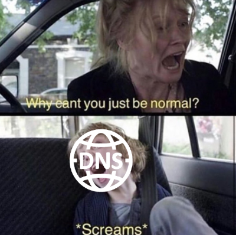
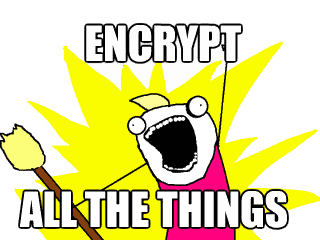

The way DNS works right now is pretty bad. It can (and probably already does) single handedly compromise the security of your web traffic.

Use of TLS and HTTPS to encrypt and protect digital traffic is more or less ubiquitous now. In contrast, traditional DNS today remains woefully un-encrypted, creating a very obvious weak link in your entire network.

It's comparable to that one kid in your high school gym class who couldn't follow instructions, but for some reason your coach decided to punish your entire class instead. One minute you're happy, the next minute you're doing pushups for no good reason, all because Kevin thought it'd be funny to shout 'Deez nuts' while carrying a basketball in each hand. Fuck you, Kevin.

### _Okay, so DNS by default is un-encrypted. But what's the worst that can really happen?_

The biggest problem is that this allows anyone who can access your internet traffic, to intercept the DNS requests and spoof it completely.

In case you didn't know, a DNS request is what converts a domain (like `arvind.io` for example), to its actual intended IP address where the website or service is located on the internet.

This means that an attacker can intercept this DNS request of yours, and simply give you a wrong IP address. This wrong address could take you to a completely different malicious website, and you may not even know it.

[DNS hijacking](https://en.wikipedia.org/wiki/DNS_hijacking) attacks like this are incredibly common. One such major attack happened earlier this year.[^1]

The scariest revelation here however, is that the biggest culprit of them all are our Internet Service Providers.

This is not speculation. Many ISPs have been documented actively doing this.[^2] I know mine does, and there's a good chance that so does yours, which means you're probably already a victim of such an attack.

##### If porn sites or The Pirate Bay is blocked for you (even with HTTPS), then DNS hijacking is most likely how your ISP is doing it. Refer to the section below on good available solutions. Simply changing your DNS server or settings won't help.

If you read my last post on data privacy, you might remember me mentioning how I caught my ISP in the act.[^3] Concerned citizens have also appealed to TRAI asking the government to take action against such practices.[^4]

Un-encrypted DNS also poses a threat to your privacy, as anyone who can access your internet traffic now also has information on which sites you are visiting.

Encrypting DNS requests solves all the above problems.

##### There is one exception. You might read in some places (for example, in [this article](https://nakedsecurity.sophos.com/2019/04/24/dns-over-https-is-coming-whether-isps-and-governments-like-it-or-not/)) that this also solves privacy with respect to your ISP. That is a common misconception and it is not true. Even without reading your DNS requests (regardless of whether it is encrypted), your ISP can figure out which sites you're going to.[^5] The only way to avoid that is to use a VPN, but in that case your VPN then has access to which sites you're visiting. In the end, it boils down to which service you trust more.

### _Okay, so what are the solutions?_

By default, your network will be setup to use your ISP's own DNS servers. It might seem like a good idea to change the DNS servers to [Google DNS](https://developers.google.com/speed/public-dns/docs/using) or [OpenDNS](https://www.opendns.com/) (run by Cisco), but in the case of DNS hijacking, this is not good enough.

The DNS requests will still be sent as plaintext. We need to encrypt these requests.

There does exist [DNS over TLS (DoT)](https://en.wikipedia.org/wiki/DNS_over_TLS), and [DNS over HTTPS (DoH)](https://en.wikipedia.org/wiki/DNS_over_HTTPS) for this exact purpose, however they haven't quite caught on yet.

The adoption rate is slow, the support is still catching up, and installation can range from very simple to quite complicated.

I've been using [DNSCrypt](https://dnscrypt.info/) for the past couple years, and it's worked great. It's very customizable, can be made to filter out ads, and supports DoH (if you need it).

I run my own DNSCrypt resolver and I get a latency of ~2ms which works really well for me. It is on the [list of public resolvers](https://dnscrypt.info/public-servers) (search for `arvind-io`), so feel free to use it if you're in or around Bangalore, India.

##### I don't know how many actual people are relying on it currently (I keep no data, including logs or analytics), but if you are, and you're reading this, you're welcome. Two summers ago, when my server faced a couple hours of accidental downtime while I was gone for vacation, I was fairly surprised to find a bunch of emails asking about the resolver. Until that point, I had no idea anyone else was using it.

If you insist on using DoT, [Stubby](https://github.com/getdnsapi/stubby) has a good reputation. It is identical to DNSCrypt in terms of setup, but it didn't really stick with me.

I know I'm probably biased towards my own choice, but I hope I've convinced you why it's important to change traditional DNS as we know it and laid out some good options for you to do that. Which solution you pick past this point is up to you.

Here's to a future with no un-encrypted internet traffic. I can't wait to see how creatively my ISP tries to block sites next.

[^1]: [1. DHS: Multiple US gov domains hit in serious DNS hijacking wave | Ars Technica](https://arstechnica.com/information-technology/2019/01/multiple-us-gov-domains-hit-in-serious-dns-hijacking-wave-dhs-warns/)
[^2]: [2. DNS Hijacking : Manipulation by ISPs - Wikipedia](https://en.wikipedia.org/wiki/DNS_hijacking#Manipulation_by_ISPs)
[^3]: [3. Indian ISP ACT Fibernet blocks bit.ly. Does DNS Hijacking](https://shantanugoel.com/2016/09/17/indian-isp-act-fibernet-blocks-bit-ly-does-dns-hijacking/)
[^4]: [4. TRAI urged to take action against P2P throttling and DNS hijacking - The Centre for Internet and Society](https://cis-india.org/internet-governance/p2p-throttling-and-dns-hijacking)
[^5]: [5. DNS over TLS is not designed to keep your privacy from ISP - Information Security Stack Exchange](https://security.stackexchange.com/a/200219)
