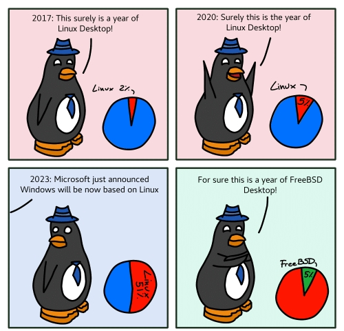

> The Linux Operating System...

You've read this phrase before, I'm sure. Perhaps more than once.

But is that really what Linux is?

Now before you bring out your pitchforks and try to crucify me for saying that it is not, keep a few things in mind :

We're arguing semantics here. Interpretations of proper nouns usually depend on majority convention, but it is my personal worldview that adopted conventions should also make sense.

_Enough banter dude. So what is Linux according to you then?_

Linux is a **kernel**. \
Operating Systems _based_ on Linux or the Linux kernel are called Linux distributions or Linux distros.

Now while I admit terminology is not my field of authority, and I'm sure that is the case for most people using Linux as well, it won't stop me from forcing my opinions in your face. So follow me through this post while I put down some carefully constructed arguments for you to reject without fully reading.

### If Linux is an OS, then what OS is my Ubuntu laptop running?

Is it Linux or is it Ubuntu? Which is the actual Operating System here? \
Don't tell me it's both.

I'm just kidding. \
I'm not actually running Ubuntu on my laptop. Can you imagine how horrible that would be?

So no, on a serious note: it is not both. The Operating System that's running would be Ubuntu, a Linux distro. \
However it would also be right to say that it is running Linux, since you can run a kernel, nothing wrong with that; but Linux here is not the Operating System.

### If Linux is an OS, then what kernel does it run?

_The Linux kernel duh! You stupid or something, Arvind?_

...I could be.

But I'm also pretty sure that if Linux ran on Linux, that would make less sense than actually running Linux inside Linux with a Virtual Machine; the latter of which probably has some need for someone somewhere.

There is a common convention where people assume Linux refers to both, the Operating System and the Linux kernel; meaning that according to them, Linux does indeed run Linux. \
What a nice convention. No scope for confusion and ambiguity at all, right?

If you're one of those people, I hope you're happy with my failure to search for relevant memes. I cleared my browser history, but nothing can clear my conscience.

### If Linux is an OS, then why are binaries (or guides) for Debian not always compatible or applicable to Arch as well?

Even if the underlying Linux (kernel) version of both your Debian and Arch installs are the same, they are both different Operating Systems. That is why.

They might have the kernel in common, but the rest of the Operating System(s) are built on different architectures.

There is the [Linux Standard Base](https://en.wikipedia.org/wiki/Linux_Standard_Base) to help with binary compatibility across distros, but if you're worried about actual usability, don't be. After all this is Linux, so of course there's a [`pacman` equivalent for Debian](https://github.com/icy/pacapt).

##### Somehow there's no `apt` equivalent for Arch. Sad.

### If Linux is an OS, what is UNIX?

Another controversial definition, but they're not related.

UNIX is a set of standards. That's it. \
I learnt this in college, and it might be among the few useful things I've taken away from class.

##### Historically there's more to it of course, but it's too big to discuss in this post, just like Torvald's ego.

On a very rough and simplified scale, you can think of it as : \
UNIX : Linux :: Linux : Ubuntu.

### _I don't really care about these arguments, Arvind. I clicked on this because of the penguin on the thumbnail_

Well... I mean I guess that's fair.

That's probably a better reason to read this post than most others. \
We Linux users don't have much going on for us anyway.

Either way, I'm happy to get this off my chest. If this post rustled your jimmies, I won't apologize, but upsetting anyone was clearly not the point.

Now if you'll excuse me, I have to get back to spending the rest of my days in fear of getting a mail from Linus Torvalds, or worse, Richard Stallman.
