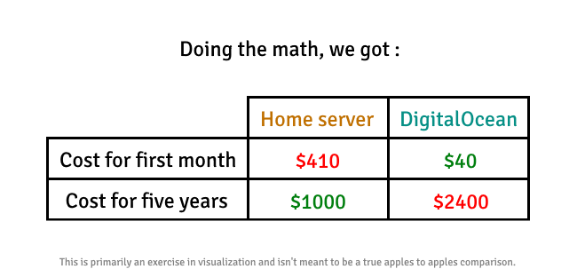
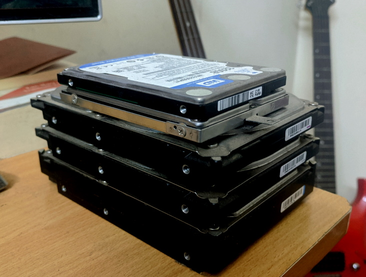
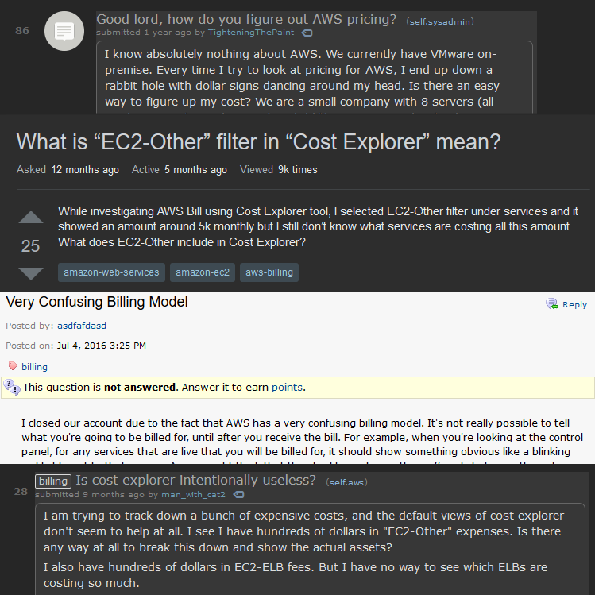
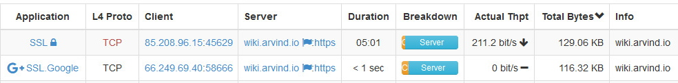

It's a tale as old as time. You've discovered the joys of self-hosting. You've fallen in love with open source. You've stumbled across the self-hosted community and can't stop installing random software that you'll barely use yourself. You're not sure how what started out as "just a hobby", ended up with you down this rabbit hole that your spouse probably thinks is worse than a drug habit. Whatever the case, it's now a done deal. This is now a commitment you enjoy.

But did you make the right choice? Should you build a server setup yourself at-home/on-premise, or is it best to rent servers from a cloud provider? The answer as usual is... _it depends_.

There are significant differences between the two. I maintain both, a home server setup and a cloud setup for my own services, and while I've learnt over the years that pricing and availability/uptime are usually the deciding factors, there are also a lot of hidden pain points and gotchas that no one told me about that I had to learn the hard way.

##### This is not a sysadmin post and you should not be reading this if you are deciding for a company. My experience with my clients as part of my profession is not comparable because companies have vastly different and often insane (or opinionated) requirements. I'm going to assume that you're reading this mostly to host your own personal services.

## Cost

Home Server: The primary cost here is upfront. You buy the server hardware and also spend time to set it all up which sometimes takes days. After that, you also have to pay for electricity and internet.

However, this option can prove to be very affordable if your server requirements are reasonably light. You could build your server out of spare/old parts if you have those lying around, which greatly reduces the upfront cost. You're probably paying for internet in your house or on premise anyway, and for an average desktop as a server running all day, you could be comfortably under \$10 per month on electricity (depends on your country/region).

If budget is your main limiter, this might be the best option because you can literally just re-purpose your old laptop or desktop and get away with only electricity as the extra cost.

Cloud: You are charged a rate that is either fixed or pay per use. While the rates might give the impression of being cheaper than the upfront cost of a home server, it adds up over time and will always tend to be the more expensive option in the long run.

It's not for nothing though. There are a lot of things given implicitly by your cloud provider which might make that extra cost over time well worth it. Things like consistent networking, automatic upgrades to current gen hardware, much lower risk of power outage, no time wasted fiddling with any initial system setup, and a lot more are included in that extra value. We'll talk about some more of these in a bit.

But let's actually visualize this difference in cost. We're going to compare the cost for a basic 4 core CPU + 8 GB RAM machine.

Home server cost: \
$400 upfront for new computer parts ([PCPartPicker list](https://pcpartpicker.com/user/EnKrypt/saved/Q6QrrH)) \
\+ $10 for electricity per month

##### We're calculating electricity consumption at peak server load for the parts we picked out. Across most states in the US, the electricity cost comes up to below \$10.

Cloud cost: \
\$40 per month ([DigitalOcean fixed rate](https://www.digitalocean.com/pricing/))

## Availability/Uptime

Home Server: If you have a service with a high availability or near 100% uptime requirement, then good luck. Trying to achieve high availability on a home server is like trying to build an airplane by yourself. It'll take you very long, there are entire companies who specialize in doing it better, and if something goes wrong when it actually matters, you probably won't even get to say goodbye.

You have to account for power failure, data corruption, your ISP throwing a tantrum, overheating, dust buildup, accidental flooding, the butterfly effect, the Kool-Aid man, etc. This is a problem that can keep you involved for months, but if that's your thing, go ahead. Just know that at this point you're basically close to doing what a cloud provider or other IaaS companies already do as a business.

##### There really is no low effort route here. Simply running a second home server in some configuration and calling it high availability is a bad idea. If you just want to protect your data, follow good backup practices. If you want your application to at least survive a drive failure, run a RAID configuration. If you want high availability, put in the work or try the cloud.

Cloud: High availability is where the cloud shines. Not only do cloud providers themselves have dedicated managed services around high availability, but even if you wanted to manage the service yourself, it's still comparatively easier to do it on the cloud because you don't have to deal with the hardware side of the setup at all.

Cloud services tend to be tailored around high availability so it really should be your initial default pick if that's a priority.

#### Now let's talk about some of the lesser known differences

## Hardware maintenance

Very few people talk about it, but this is a measurable pain if you're running a home server. Mechanical hard drives will eventually fail, any fans will slowly degrade and you will have to clean out the dust buildup every few months. You will also very likely have to upgrade the hardware itself every few years if you don't want to be stuck with old and slow parts from your parents' generation. Even if you love tinkering with hardware, the timing will probably be such that you will have to take downtime and open up the chasis when you'd planned for doing something else that day.

Here's my collection of dead hard drives from the home servers I've run over the years before I switched to SSDs. Every one of them also killed the plans I had for the day they died.

The default winner here is the cloud. All that stuff gets automatically taken care of by your provider and you won't even know about it. At most, you'll have to deal with scheduled maintenance emails once in a while that most of the time don't even impact your applications.

## Surprises in your bill

The worst offender here is probably AWS. If you've signed up for a pay per use model with a cloud provider, it's hard to predict what your final bill is going to be at the end of the month. Even with their pricing charts and cost calculators, it's hard to estimate your bill not only because they make several assumptions in their calculations that might not be true for you, but also because your usage will fluctuate and using a particular cloud service might automatically rack up usage in another service or category.

That said, once you do get the hang of how it works (it is possible, just takes a bit of time), you might be able to optimize your usage to fit expectations, yielding impressive cost savings over fixed plans. If you want to venture down this road, I suggest experimenting with some promotional credits first to understand how things are priced, setting up email alerts when your bill exceeds certain amounts, and then comparing the final cost to managed or un-managed counterparts, alternative services and different providers for your use-case.

##### I will not be giving away any promotional credits here. As I've said before already, I do not make any money from this blog, nor do I want to market for any company that I mention in my blog. Fortunately, it's quite easy to find cloud credits if you were to simply look it up.

If you went with a home server, you get to relax because you've already paid for your compute and storage. Hopefully your internet connection has a fixed upper cost. The only fluctuation you might see is on your electricity bill depending on how much time your server(s) spend idle or under load.

## Bandwidth

On two separate occasions, My ISP flagged my home account because I had used up more than 500 GB of data in only a few hours. In the first incident, I had a DDoS attack on an open port on my home server (there was never a security risk, I just never accounted for an attacker bleeding my bandwidth dry). In the second incident, I noticed that several web crawlers (Google's included) were going over my entire self-hosted wikipedia page by page.

Running ntopng is how I made that discovery:

I didn't even know until then that this was a factor to consider. Bandwidth and data transfer is something cloud users can take for granted because most services are designed with high traffic in mind, and even in the worst case you pay a little extra for that data instead of having everyone in your house complain that the internet is down because of something you did.

## Heat and noise

CPUs run hot. If you're running one or many of them 24/7 in a home server setup, that room is going to be hotter than the others. I have taken advantage of this during winter to warm my room, but summers can be brutal if you don't have air conditioning. On top of that, if your server is not dissipating heat properly, it may be thermal throttling and affecting performance because of a bad heatsink install; something to monitor for.

Servers also make noise. If you sleep in the same room as one, you will be very aware of its presence when you sleep if the moving parts weren't carefully picked out. It's usually the fans that contribute the most here. I had to swap my server's PSU to a semi-fanless design before I could sleep in peace.

If you use the cloud, you won't even know these problems exist, making it again the winner here.

---

## In conclusion

Ultimately, it boils down to what your needs and preferences are.

Do you enjoy dealing with computer hardware enough to put up with the heat, noise, cleaning, maintenance, upgrading, etc.? Then go ahead and build your own home server.

If availability is your main goal or you'd rather pay a little extra for a more hands off experience, the cloud might be right for you.

What you choose past this point is up to you. Both options have clear pros and cons. There is rarely ever a one-size-fits-all solution in computers, so keep experimenting and don't let a fear of trying out new things hold you back.

Thanks for reading, and I'd love to hear what unique challenges you faced going down your route.
