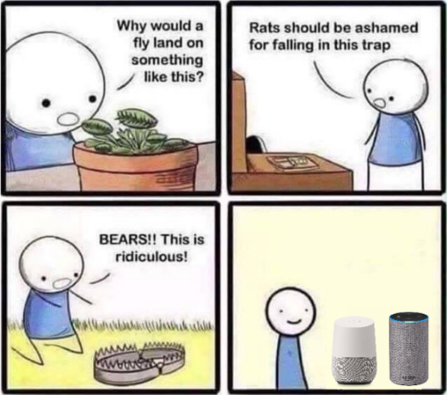
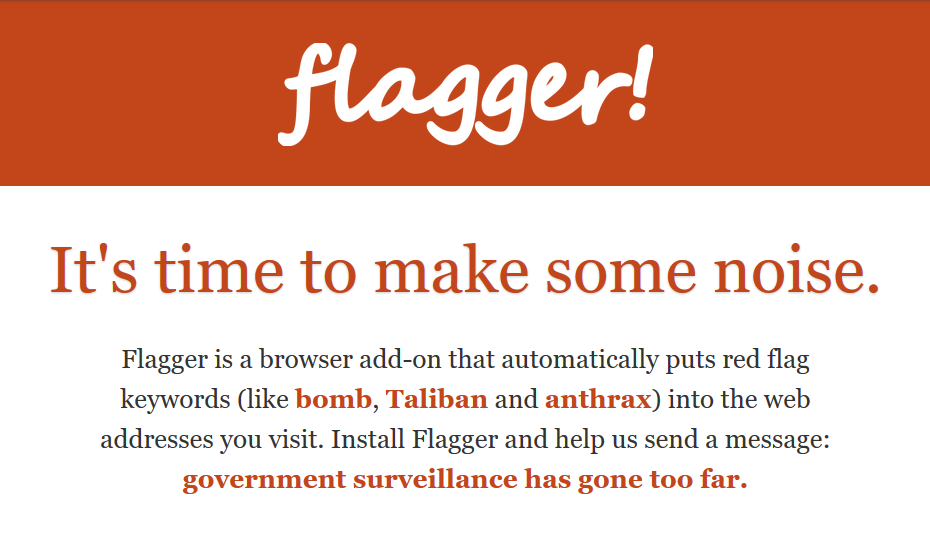
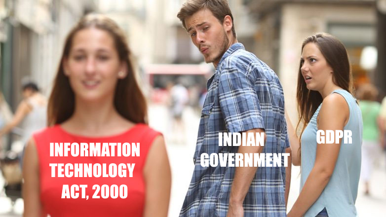
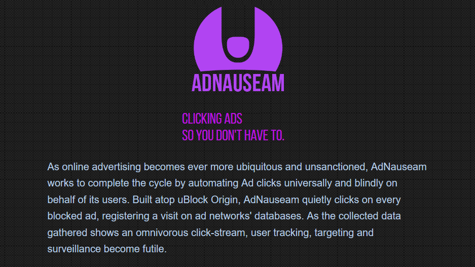
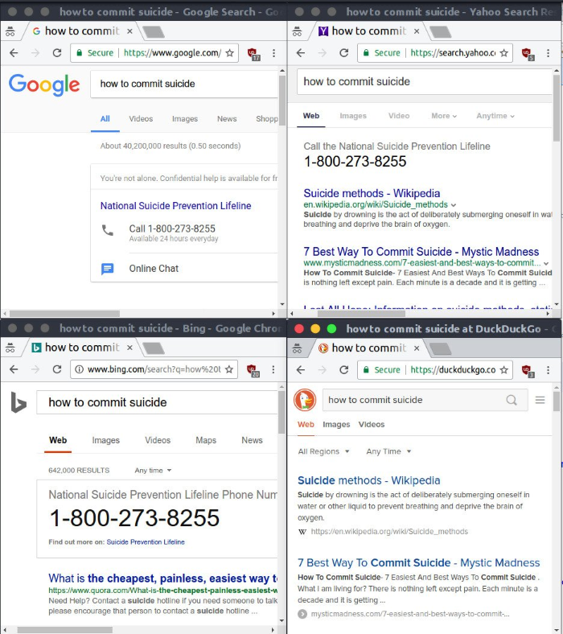

> Arguing that you don't care about the right to privacy because you have nothing to hide is no different than saying you don't care about free speech because you have nothing to say. ~ Edward Snowden[^1]

Edward Snowden may not have pioneered the resistance against the 'Nothing to hide' argument[^2], but he's made it quite clear that we're losing ownership of our own data faster than we can do much about it.

Just the other day, I was at a bar with a couple friends when the question of _should we even care about data privacy_ came up.

It seems that most of us have long resigned to our data being taken away. The real question is more along the lines of: _Do you want to protect your data, or do you want to use Google and Amazon?_ For most people, the former does not even come across as a realistic option. You don't have to look at the sales numbers for Google Home or Amazon Echo devices to know that this is true.

##### If you did however, you'd find that around one in five US adults own a smart speaker.[^3] Oh boy.

Data privacy is important for more reasons than just being edgy or making a stand. There is a lot of damage that can be done by leveraging information against an individual, and after a certain point, the lines get too blurred to to tell the difference between right and wrong, innocent and guilty. Even completely correct information taken out of context can prove harmful.

As a very primitive example, let's say you accidentally managed to get on the wrong side of someone in a position of power. They can frame you on completely fabricated charges by simply wrapping it up with the remaining _correct_ data they have on you. Your friends and family read about it and they think _'Oh yeah, he does tend to drink quite often. I guess it was only a matter of time until he was caught driving drunk.'_, and before you know it, you have no support from them because they bought the lie.

This is just one (poorly written) example. I'm all for catching terrorists and putting them behind bars, but snooping on our texts and calls is not the way to do it. Lack of data privacy opens up a pandora's box of nightmare scenarios where one has no idea which information is legit and which has been deliberately manipulated.

Now, before the conversation at our table derailed back to whether or not MacBooks are stupid, and how the partition of India didn't exactly happen like how we would've liked it, I realized a couple things based on our conversation :

-   You can't have perfect data privacy unless you go off the grid, which none of us wanted to do.
-   As a result someone somewhere has a profile on you, pieced together by your online fingerprint.
-   That profile with all its data is probably worth some money.

_Ok, Arvind. What's next? Are you going to tell us that the moon landing was faked too?._

Alright, I know what this sounds like if you've not yet done your homework. In fact, this is probably your mental image of me at this point, right?

The difference however, is that unlike a conspiracy, we have actual precedence to things like this happening all the time.

[The Great Hack](https://www.imdb.com/title/tt9358204/) is a Netflix documentary about the Cambridge Analytica scandal.

[Citizenfour](https://www.imdb.com/title/tt4044364/) is a documentary about Snowden's revelations on the NSA.

It's more than speculation. These things happen all the time and are also dominant themes in the entertainment industry. We only know about the ones that eventually got caught, keep that in mind as well.

##### If you're into video games, you should try [Orwell](<https://en.wikipedia.org/wiki/Orwell_(video_game)>). You play as a surveillance operator and the information you cherry-pick decides who gets the short end of the stick in the game.

Now, the important question is: _Do we really need **perfect** privacy?_

A disclaimer if you didn't already know this about me: I used to be, and still am to an extent, a big privacy nut. I've put black tape over my webcam back when I had a MacBook, I've lived for years with just Arch Linux and I'm still running Lineage on my Google Pixel.

Now that's a lot of pain and I don't expect everyone to go to all those lengths for the sanity of owning their data, especially when I'm not consistent in following through most of it myself.

But after years of painfully trying to do so, I can safely say that neither I nor the companies collecting my data care that I don't like pineapple on my pizza, or that I prefer Maine Coons over Bengals. Perfect privacy is not just painful to implement, but also gets you diminishing returns.

At any rate, I'd argue on the flip side that no privacy might still be preferable to bad attempts at privacy, such as installing something like say, [Flagger](https://github.com/rubbingalcoholic/flagger).

##### Long story short, it more or less failed at its goal, and I do not recommend anyone installing it, even as a joke.

Luckily India is not part of the Five Eyes, Nine Eyes or Fourteen Eyes[^4], but there is overwhelming history of organizations abusing personal data and laws being enforced that ideally shouldn't have even made it to the drawing board.

For example, the government can compel you to give up keys or passwords to access data that is encrypted or password protected for an investigation.[^5]

An internet provider here has been actively hijacking DNS requests.[^6] Something I stumbled across myself, but I was too lazy to document and write about at the time.

If we combine the fact that we don't need perfect privacy along with the fact that our governments' can barely handle their own elections without completely fucking it up, then all of a sudden, data privacy becomes a lot more doable.

We just need enough privacy to hide the things that would matter to anyone, and leave the rest as too disjointed or obfuscated to piece back together. As a result, if they do get some data on you, it's either incoherent, meaningless, or useless.

Similar to Flagger, [AdNauseam](https://adnauseam.io/) is another example that tried to accomplish such a goal.

##### Again, I must ask that you do not install this. Even if you're polluting tracking data, the ad network still gets information about you and your browsing habits.[^7] Using [uBlock Origin](https://github.com/gorhill/uBlock/) remains the best way to disable ads without hurting your privacy.

Having said everything above, obtaining a reasonable amount of privacy is actually pretty easy if you're ready to compromise. You'll have to switch some of your everyday apps to a better equivalent (some of which you might actually find easier to use), and you'll have to give up the notion of perfect privacy for reasonable privacy.

As a good first step, simply using [Firefox](https://www.mozilla.org/en-US/firefox/new/) instead of Chrome can do wonders. I won't go into detail about how Firefox has always been a part of the privacy battle, but you might even remember it as Netscape Navigator back when Internet Explorer had its monopoly.[^8] Today of course, Google Chrome has the majority, and it's quite sad that neither Microsoft nor Google had their users' best interests in mind.

Having been a long-time Chrome user, I was personally surprised to find the transition pretty smooth. The dev tools are great, all the extensions I used on Chrome exist as Firefox add-ons, and the browser is just a lot more customizable. Firefox for Android even supports add-ons, meaning that you can run a full ad-blocker or download themes for your mobile browser. However I decided to use Firefox Preview because of the smoother UX.

[DuckDuckGo](https://duckduckgo.com/) has come a long way as a search engine. I found myself not having to do wordplay gymnastics whenever I wanted to look up something specific but niche, since Google would always fuck it up with personalized and popular results.

##### There are some drawbacks, and I have to make this clear. DuckDuckGo isn't very good at handling long and vague queries, such as ones where you feed it a lot of context to make it guess what you want. Its index is also not as exhaustive as Google's, but none of this has been a problem for me except when I was looking up something really obscure.

##### Sometimes its tendency to get straight to the point can be a bit _too_ brutal though.

A better browser + search engine is half the battle done. You could follow this up by thinking about your PC and your phone's OS, using a password manager, choosing messengers more carefully, and staying away from personal social media.

##### Deleting Facebook, Instagram and Snapchat was the best thing I've done for my mental health and overall productivity.

[PrivacyTools](https://www.privacytools.io/) is a very good resource if you want to keep exploring.

**I know I can't convince you to stop using Gmail or Google Maps**, but that's alright in my book. I use them too because the alternatives suck, I get it. This post was not meant to be a privacy guide or a top ten list of what you should or should not do.

The point was more to get you to think about privacy in the context of your online activity. There are enough data breaches happening all the time by malicious attackers, that we don't really need to give away our data willingly on top of it.

Given the general apathy in this country toward good tech practices, I'm honestly impressed that we managed to tell Zuckerberg to fuck right off when he pitched Free Basics to us.[^9] Somehow that gives me hope that we might not be a lost cause just yet, and we can eventually stop all our Whatsapp forwarding uncles from telling some surveillance worker their bank balance along with how there was not enough chutney with their dosa everyday.

&nbsp;

##### Publicly writing about data privacy while making fun of our government does not have a very good track record. Time will tell how much trouble I might get into for this, but I will not take this post down willingly. If it does go down, let's say that you probably know exactly what happened. Feel free to take backups.

&nbsp;

[^0]: [0. Palestinian wall art about Mark Zuckerberg and Facebook - Imgur](https://imgur.com/gallery/dqtkB)
[^1]: [1. Edward Snowden and Jameel Jaffer Reddit AUA on Reddit /r/IAmA](https://www.reddit.com/r/IAmA/comments/36ru89/just_days_left_to_kill_mass_surveillance_under/crglgh2/)
[^2]: [2. Nothing to hide argument: Revision history - Wikipedia](https://en.wikipedia.org/w/index.php?title=Nothing_to_hide_argument&dir=prev&action=history)
[^3]: [3. 47.3 million U.S. adults have access to a smart speaker, report says](https://techcrunch.com/2018/03/07/47-3-million-u-s-adults-have-access-to-a-smart-speaker-report-says/)
[^4]: [4. Five Eyes - Wikipedia](https://en.wikipedia.org/wiki/Five_Eyes#Other_international_cooperatives)
[^5]: [5. Key disclosure law - Wikipedia](https://en.wikipedia.org/wiki/Key_disclosure_law#India)
[^6]: [6. Indian ISP ACT Fibernet blocks bit.ly. Does DNS Hijacking ](https://shantanugoel.com/2016/09/17/indian-isp-act-fibernet-blocks-bit-ly-does-dns-hijacking/)
[^7]: [7. Xaquseg comments on Built atop uBlock-Origin, AdNauseam quietly clicks... ](https://www.reddit.com/r/privacy/comments/4nalvo/built_atop_ublockorigin_adnauseam_quietly_clicks/d42d24l/)
[^8]: [8. History of the Mozilla Project - Mozilla ](https://www.mozilla.org/en-US/about/history/)
[^9]: [9. Nothing free or basic about it - The Hindu ](https://www.thehindu.com/opinion/op-ed/nothing-free-or-basic-about-it/article8042334.ece)
