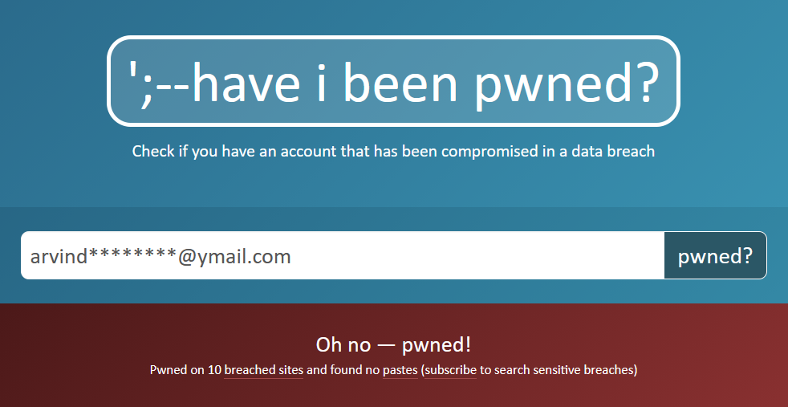
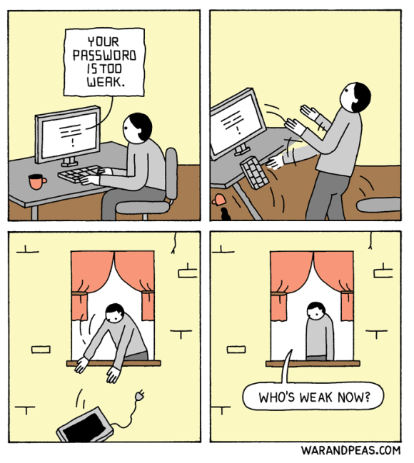
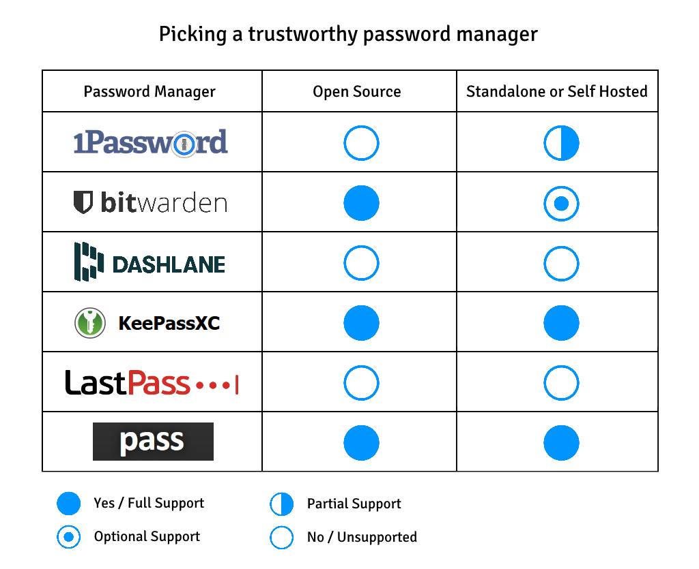
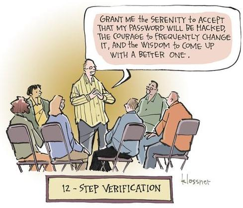

    
Index

    <ul>
        <li><a href="#intro">Who is this guide for?</a></li>
        <li><a href="#bad-habits">Bad habits and how ugly they can get</a>
        <li><a href="#password-managers">Password Managers to the rescue</a></li>
        <li><a href="#configuration">Picking and setting up a trusted password manager</a></li>
        <li><a href="#multi-device">Syncing and backing up passwords across devices</a></li>
        <li><a href="#outro">Parting thoughts</a></li>
    </ul>

<h2 id="intro" class="internal-link">Who is this guide for?</h2>

Passwords are just one of the many things we give to companies when we sign up for a service, and with watching these companies repeatedly fail to secure our data despite their promises, comes a new realization of just how much of our own data and privacy exists outside of our control.

Any system security engineer worth their salt will tell you just how fragile security implementations are in the real world. No matter how big the company, your passwords are not guaranteed to be safe. Sadly, many victims are all too familiar with this, and among those harshly educated about this reality include familiar celebrities, like Jennifer Lawrence and Kate Upton.[^1]

There's not much you can do about Apple being incompetent about their security, or Google being nefarious with your data, but what you can do is make sure that one compromised data breach doesn't mean that all your logins across other websites or apps are also compromised.

This guide exists for that reason, to help you figure out best practices in managing your passwords and to minimize the damage in case you happen to fall victim to a leak.

This guide is for you if :

-   You reuse the same password across many websites or apps.
-   You don't reuse the same password but you often have to reset passwords because you can't remember them.
-   You use a password manager, but you're not sure if you can trust it.
-   You use a password manager, but you don't know how to access it easily (across all your devices).
-   You want to know what the best practices are, or you're not familiar with the risks of bad password management.

<h2 id="bad-habits" class="internal-link">Bad habits and how ugly they can get</h2>

Before we can jump right into securing your passwords, we need to first understand how bad things can get if there's not much thought put into password management.

##### I don't recommended it, but if you're really eager to just pick up a password manager and start using it, you may skip this section.

The main (and sadly very common) problem is password reuse. If your login info gets leaked in a data breach, attackers would attempt logging into other websites with those same credentials because they know that password reuse is something a lot of people do.

Let's say Twitter gets hacked tomorrow, and your email/username and password happens to be in the list of exposed user data. You might quickly change your Twitter password and believe all is well until you realize you can no longer log into Spotify because an attacker got in with the same username and password and locked you out by changing the credentials themselves.

**No, this is not a 'what if' or an edge case scenario. Data breaches like this happen all the time and include very recognizable companies like Adobe, eBay, Uber, Blizzard, CVS, JP Morgan Chase, and I can keep going.**[^2]

Chances are that you're already a victim of such a breach. Head over to [haveibeenpwned.com](https://haveibeenpwned.com/) to check if your data associated with your email has been publicly leaked in an attack.

The emails I currently use are all fine, luckily. However, I checked with an old yahoo mail account that I no longer use, and the results were not so nice.

The other main issue is password predictability.

You might think that if you put in your favorite sport as your password such as 'football' or 'baseball', that should be sufficiently personal and make it hard to guess, right?

Well they're both in the list of top 25 most common passwords in the last seven years[^3], so you decide. To put that into perspective, if you randomly tried 'football' as the password in the SplashData 2016 surveyed list, your odds of being right would be greater than one in three hundred.[^4] That's ridiculous once you imagine a dedicated attacker who has more than enough time and resources to attempt a targeted bruteforce.

There's a reason why websites and apps insist that you add things like special characters, numbers and different case letters to your password. That's because these things make your password harder to guess.

##### Capitalizing the first letter to make it 'Football', or using an easy to remember but meaningless pattern on your keyboard like 'zaq1zaq1' wouldn't help either. They're both in the same common passwords list.

##### You may have also read in [this XKCD comic](https://xkcd.com/936/) that a long string of words is safer than a shorter "gibberish" password with numbers and special characters. This isn't entirely true. While a string of words is easier to remember, and it does protect against most bruteforce attacks, it falls quite quickly to a smart attacker running a targeted dictionary attack. Your "gibberish" password (of sufficient entropy) generated by a password manager will not. Sorry to step on your Randall Munroe circlejerk, but he is after all a webcomic author. His advice is good if you're not using a password manager, but we fully intend to.

_Alright, so all I need are unpredictable passwords that are unique for every login, right? Do I really need this guide to tell me how to do that?_

By design, the better and the more unpredictable a password is, the harder it is to remember. Since you need a different unpredictable password for every service you use, that can quickly become a problem. Luckily, this entire guide is about the solution.

<h2 id="password-managers" class="internal-link">Password Managers to the rescue</h2>

Writing all your passwords down in a book or a piece of paper sounds like it could do the job, and while it does warrant use in some rare situations, I'd wager it's more cumbersome to maintain, far harder to secure and is less accessible than a password manager.

The idea behind a password manager is that you remember just one master password (or use a master keyfile) to access it, while it takes care of remembering all the other passwords you need for your apps and websites.

A good password manager is configurable and extensible, meaning that among other things, you can integrate it into your browser or your phone; perform auto-type and even take care of generating good, unique and unpredictable passwords so that you don't manually have to.

While a password manager solves the problem of generating strong passwords and remembering them, it comes with a new set of different problems that we will take a look at.

<h2 id="configuration" class="internal-link">Picking and setting up a trusted password manager</h2>

_Why should I trust a password manager? Don't the company/developers behind the password manager have all my passwords now? How is that any better?_

Sadly, this can be true. Quite a few password managers take your passwords to store in their own cloud servers and you have to _take their word_ that they wont do anything shady with it. Even if they do keep that promise, often they get hacked themselves, making that pointless. Blur and LastPass have been collectively responsible for leaking many millions of user records.[^5][^6]

The good news is that these issues are easily solved. A trustworthy password manager must follow two basic criteria :

### It must be Open Source

If the source code of a password manager cannot be reviewed by you, you should have no reason to trust it.

The philosophy of open source software is quite vast and cannot be covered here, but in general being able to read for yourself and verify any part of the software's code gives it transparency. Without it, you cannot trust any claim made by the developers.

Information regarding the software including technologies used, security measures, results of security audits, etc. become meaningless if you can't check it. They might as well have not disclosed that information.

With an open source password manager, you know that all this information can be personally verified, and you always have the ability to build the software yourself from its source.

### It must be self-hosted or standalone

Cloud based password managers have the same lack of trust and transparency that closed source or proprietary password managers do. You have to give some company all your passwords, and you have no way to confirm how they're storing it or what they're doing with it. You also risk all your user data being leaked in case the company gets hacked.

A trustworthy password manager in its entirety should run on infrastructure that you personally own.

_But it's fine! You can trust companies like 1Password and Bitwarden. They're completely secure and they'll never do anything bad with your data, right?_

It's always good to remind yourself that companies exist to turn a profit. The track record shows that if compromising your data is a new avenue to do so, then that is what they will do. Avoiding cloud based services to store your passwords isn't paranoia, it's common sense.

Who cares if company X is more trustworthy than company Y? A standalone open source password manager completely removes the question of trusting any company at all. Why not use one when you can do so for all for the pros and none of the cons?

##### You might think that a standalone or self-hosted solution shifts the security responsibility from the company to the user, but that isn't really true. Whatever liability exists has always existed. Most vulnerabilities or exploits targeting a local password manager can also be targeted at a cloud based password manager on the user's end in the exact same way. Offline databases are usually well encrypted and rarely targeted.

I took the effort to compare how some major password managers stand with respect to these two criteria.

I personally use [KeepassXC](https://keepassxc.org/) across my devices, but [Bitwarden (self-hosted)](https://help.bitwarden.com/article/install-on-premise/) is a pretty good option as well. [Pass](https://www.passwordstore.org/) (if you're into command line tools) comes highly recommended too, but it does seem to be lacking a few features so you might want to either use it with some extra plugins, or use a fork/rewrite of the project such as [gopass](https://github.com/gopasspw/gopass/) which comes included with those features.

##### In the case of a standalone password manager that's closed source, you have no idea what the software is doing under the hood. In the case of a cloud based password manager that's open source, you can never verify that the company is running the source code available. Hence we need at minimum both conditions to be satisfied in order to establish a satisfactory level of trust.

<h2 id="multi-device" class="internal-link">Syncing and backing up passwords across devices</h2>

Now that we've picked out a good password manager, we have to think about ensuring two things: that it's actually easy to use across all your devices; and that in case you lose access to a device or two, your passwords aren't forever lost.

A cloud based password manager would've automatically taken care of this, but of course we'd never recommend using one for all the reasons outlined above. Luckily, doing so on a standalone or self-hosted password manager is rather trivial, and having direct control over how it's done is in my opinion, even better.

Self-hosted password managers often have auto-syncing strategies. With Bitwarden (self-hosted), you can always access your last synced Vault offline, but backing up is manual. You can either directly backup the data on the server end[^7], or perform a client side export. If you're going to store your backup on an agnostic cloud storage service such as Google Drive or Dropbox, make sure you encrypt your data first. There are plenty of guides and tools, both official and by the community to automatically create such backups, so if you're going down this route, I recommend looking them up.

Standalone password managers work with an encrypted password database file. As a result, backing up and syncing can both be achieved in one common strategy. Since our database is already encrypted, we can directly store it on an agnostic cloud service like Google Drive or Dropbox without worries.

##### How strong the encryption on your database file is depends on a few factors. I recommend choosing a strong master password and selecting a good encryption scheme with adequate transformation rounds (higher is better) in the settings.

I have my Google Drive client set to perform automatic two-way sync. Now anytime my password database file gets updated on one device, it gets automatically pushed to all my other devices. I don't have to concern myself with taking manual backups. On my phone, Keepass2Android works well with opening a database file directly from Google Drive (and other cloud storage). This solves auto backup and sync for me, and the only effort I had to realistically put in, was to pick a cloud storage provider.

You can also make your database file publicly available by hosting it on Github, for example. This solves the problem of never losing your database backup in case you forget your Google Drive or Dropbox password. However, this also means that while encrypted, everyone else can also always access your database file, which might make some uncomfortable. At this point, I'd say it boils down to personal preference.

<h2 id="outro" class="internal-link">Parting thoughts</h2>

No matter what password manager you've decided to use and how you've set it up, it's healthy to think of your passwords and data as something with the potential to be stolen, leaked or misused. It's always worth putting in the effort to prevent that from happening.

While we did talk about passwords and password managers here in length, this isn't really supposed to be a guide on good security measures. I've intentionally left out some very obvious security tips such as using two factor authentication whenever possible, or to not generate and store your Google Drive password in your password manager if you're backing it up in the same Google Drive; because that's not the intention of this guide.

That said however, I do hope that your quest to secure your data doesn't end here. I highly recommend thoroughly going through the settings and options in your password manager while trying to understand why they're there. I also encourage reading further on good security practices in general and how to apply them.

Meanwhile, if this post helped you pick out a password manager or understand them better, I'm glad. Let me know if you'd like my opinion or another guide on a different matter, security or tech.

[^1]: [1. iCloud leaks of celebrity photos - Wikipedia](https://en.wikipedia.org/wiki/ICloud_leaks_of_celebrity_photos)
[^2]: [2. List of data breaches - Wikipedia](https://en.wikipedia.org/wiki/List_of_data_breaches)
[^3]: [3. List of the most common passwords - Wikipedia](https://en.wikipedia.org/wiki/List_of_the_most_common_passwords)
[^4]: [4. Worst Passwords | Time](https://time.com/4639791/worst-passwords-2016/)
[^5]: [5. Blur password manager exposes 2.4M users](https://siliconangle.com/2019/01/03/blur-password-manager-exposes-2-4m-user-details-misconfigured-aws-instance/)
[^6]: [6. Password Manager LastPass Got Breached Hard | Wired](https://www.wired.com/2015/06/hack-brief-password-manager-lastpass-got-breached-hard/)
[^7]: [7. Backing up your on-premises hosted data | Bitwarden Help & Support](https://help.bitwarden.com/article/backup-on-premise/)
