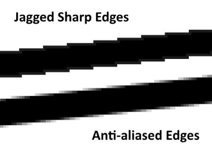

If you play enough video games, you know that Antialiasing or AA is a software technique for diminishing jaggy-stairstep-like edges that should be smooth.

If you don't, here's a quick image comparison.

I recently discovered an old book of mine where I'd written down the different types of antialiasing and how they compare for my own reference. It was a handy little thing to have so I could know which type of antialiasing meant what (there are a lot of them out there, to be honest), and which ones I should use to get the best looks out of my game without taking a huge hit to performance.

I'm going to take this guide out mostly from what I'd written in that book, so depending on when you're reading this post, there is a chance that some new features might not be covered here. You can find the sources of most of the information here by following the links in the titles.

---

### [SSAA or FSAA](https://en.wikipedia.org/wiki/Supersampling)

SS stands for 'supersampling', FS for 'full scene'.
The entire scene is rendered at a larger resolution, and the edge points from that render are used in the actual scene.

**Type** : Rendering \
**Performance Hit** : Significant, since it involves upscale rendering. \
**Quality** : Genuinely Antialiased

---

### [MSAA](https://en.wikipedia.org/wiki/Multisample_anti-aliasing)

MS stands for 'multisample'.
It is a special case of supersampling where only portions of the scene where aliasing might be noticeable are rendered at a higher resolution, like lines or edges.

**Type** : Rendering \
**Performance Hit** : Tends to be much lower than SSAA, since upscale rendering is only performed to parts of the scene. \
**Quality** : Looks the same as SSAA except in cases where certain edge polygons might go undetected.

---

### [CSAA](https://www.nvidia.com/object/coverage-sampled-aa.html) or [EQAA](http://developer.amd.com/wordpress/media/2012/10/EQAA%2520Modes%2520for%2520AMD%2520HD%25206900%2520Series%2520Cards.pdf)

CS stands for 'coverage sample', EQ stands for 'enhanced quality'.
CSAA is by Nvidia, EQAA is by AMD.
Designed to succeed MSAA, it adds more and better coverage sampling in order to produce quality like MSAA would at higher modes, but at only a small performance cost.

**Type** : Rendering \
**Performance Hit** : Slightly higher than MSAA at the same sample multiplier. \
**Quality** : Increase in quality as compared to MSAA can range from some to none at all.

---

### [FXAA](https://en.wikipedia.org/wiki/Fast_approximate_anti-aliasing) or [MLAA](http://www.hardocp.com/article/2011/07/18/nvidias_new_fxaa_antialiasing_technology/4)

FX stands for 'fast approximation'. ML for 'morphological'.
FXAA is by Nvidia (but also used on other environments due to its popularity), MLAA is by AMD.
There is no rendering involved here. Edges are detected and directly smoothed or blurred.

**Type** : Post-Processing \
**Performance Hit** : Least. Cheapest form of AA. ([Certain benchmarks](http://www.hardocp.com/image.html?image=MTMxMDIyNTU4NEVUa3NkblNuWWxfNF8yX2wuZ2lm) indicate FXAA to be faster than MLAA) \
**Quality** : Successfully removes jaggies, but normal textures may also have a blurred quality to them.

---

### [SMAA](http://www.iryoku.com/smaa/)

SM stands for 'subpixel morphological'.
It is an upgrade to MLAA where jaggies are removed with better detection without blurring too much.
In my opinion, this is best form of antialiasing due to its perfect balance of good quality for a low performance overhead.

**Type** : Post-Processing \
**Performance Hit** : Slightly higher than FXAA. Most efficient in terms of performance to quality ratio. \
**Quality** : Better than FXAA or MLAA. Morphs colors and textures appropriately.

---

### [TXAA](http://www.geforce.com/hardware/technology/txaa/technology)

TX stands for 'temporal'.
It is a mix of filtering and sampling techniques in order to get the best quality at the expense of performance. It's also designed to remove crawling and flickering from moving scenes.

**Type** : Post-Processing _**and**_ Rendering \
**Performance Hit** : Most. Much higher than post-processing methods and [might even be higher than MSAA](http://www.hardocp.com/image.html?image=MTM1Mzg4NTQ2MmN1SHJBMjd1d21fNV83X2wuanBn). \
**Quality** : Depends on implementation. Might look like a combination of MSAA and FXAA.

---

I have, to the best of my ability tried to maintain accuracy in this guide, but despite that if you feel something is out of place or needs to be changed, do not hesitate to let me know.

If this guide helped you, you are welcome, though I have a feeling that it is not going to be long before modern games do away with AA tweaking entirely and make it a standard feature of the game engines that they're built on.

##### Some types of AA were not covered here because they were either too niche, or there was inadequate information available about them, such as TrAA or CFAA. That was intentional to keep things relevant and informative.
